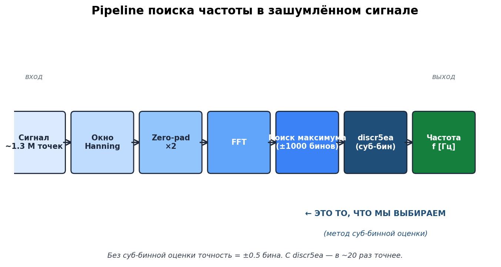
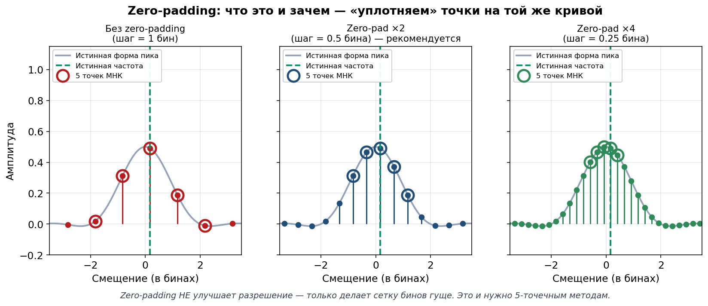
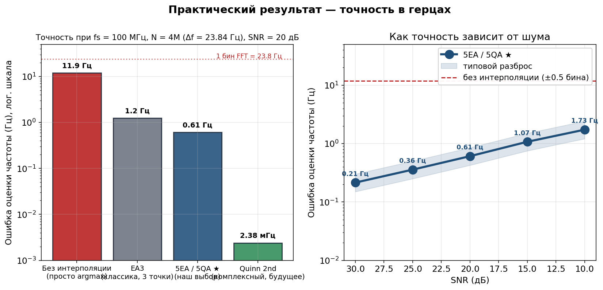
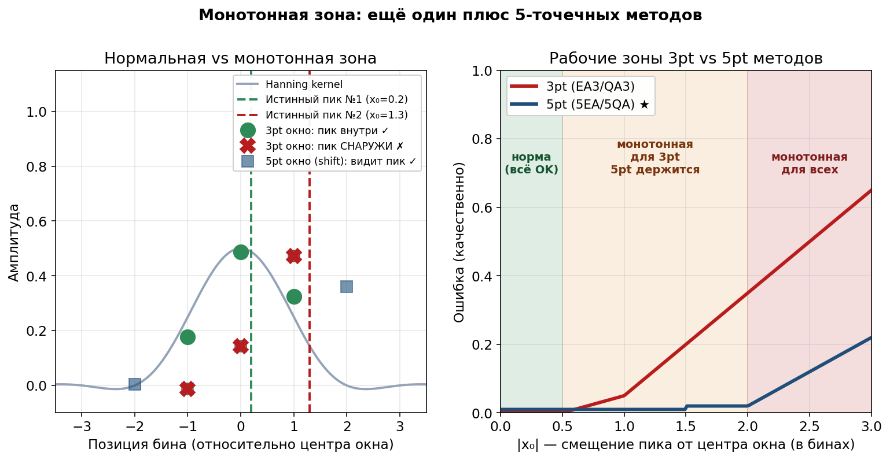
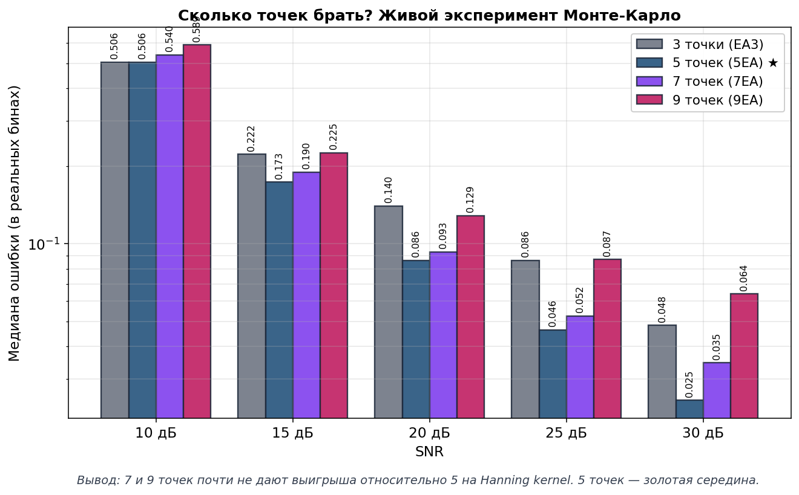
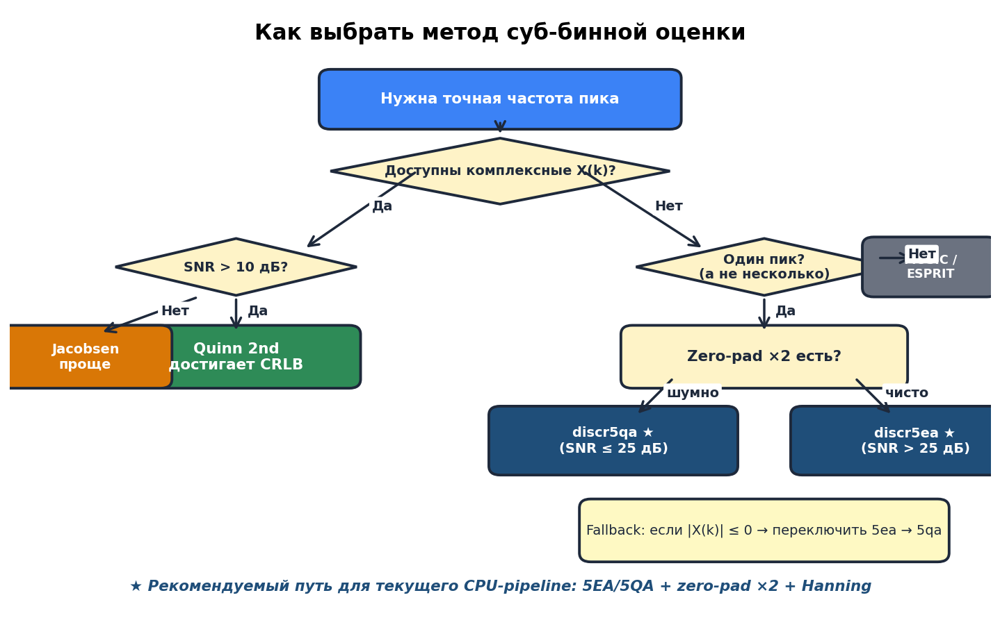

# Как найти частоту в зашумлённом сигнале

## Полный отчёт с рекомендациями — для чайника и не только

> **Дата:** 2026-04-06
> **Автор:** Кодо (AI-ассистент) + Alex
> **Проект:** `discriminator_estimates`
> **Статус:** Итоговые рекомендации на основе всех проведённых экспериментов

---

## 📜 Оглавление

1. [История из жизни — зачем всё это нужно](#1-история-из-жизни)
2. [Что мы делаем шаг за шагом (pipeline)](#2-что-мы-делаем-шаг-за-шагом)
3. [Что такое «суб-бинная оценка» и зачем она](#3-суб-бинная-оценка)
4. [Главная идея: парабола + Hanning = любовь](#4-парабола--hanning)
5. [Zero-padding — что это и зачем](#5-zero-padding)
6. [Какие методы мы пробовали](#6-методы-сводная-таблица)
7. [Главный эксперимент: кто победил](#7-главный-эксперимент)
8. [Что это значит в реальных герцах](#8-точность-в-герцах)
9. [Ещё один плюс 5-точечных методов — монотонная зона](#9-монотонная-зона)
10. [Почему именно 5 точек, а не 7 или 9](#10-почему-5-точек)
11. [🏁 Итоговая рекомендация + дерево решений](#11-итоговая-рекомендация)
12. [Quick reference — как использовать](#12-quick-reference)
13. [Что дальше — Quinn 2nd и комплексный pipeline](#13-что-дальше)
14. [Словарь терминов](#14-словарь)
15. [Ссылки и источники](#15-ссылки)

---

<a name="1-история-из-жизни"></a>
## 1. 🎯 История из жизни — зачем всё это нужно

Представь **радар** (или эхолот, или сонар — не важно). Он излучает
радиоволну, она летит, отражается от цели (самолёта, корабля, рыбы) и
возвращается. По времени возврата и по изменению частоты можно понять:
- как далеко цель;
- с какой скоростью она движется;
- в каком направлении.

Но вот беда: **возвращается не только полезный сигнал, но и шум**.
Атмосфера, электроника приёмника, волны на море, помехи от других передатчиков.
Шум может быть в десятки раз сильнее самого отражения.

**Наша задача:** среди этого шума найти **одну конкретную частоту** —
ту, в которой «сидит» отражение от цели. И найти её **очень точно** —
потому что точность по частоте прямо переводится в точность по дальности.

Простая аналогия:

> Ты стоишь в толпе на стадионе, где все кричат, и пытаешься услышать,
> на какой именно ноте поёт один конкретный певец. Шум — это толпа.
> Певец — наша полезная частота. Найти его голос в этом хаосе —
> это и есть наша задача.

---

<a name="2-что-мы-делаем-шаг-за-шагом"></a>
## 2. 🏭 Что мы делаем шаг за шагом (pipeline)

Вот что у нас происходит от сырого сигнала до ответа:



Разберём каждый шаг простыми словами:

### 2.1. Сигнал ~1.3 миллиона точек

На вход приходит запись — это много-много измерений
комплексной амплитуды сигнала. Например, 1.3 миллиона отсчётов при
частоте дискретизации 100 МГц = запись длиной 13 миллисекунд.

### 2.2. Окно Hanning — «сглаживаем края»

Прежде чем считать FFT (спектр), умножаем сигнал на специальную кривую
в форме колокола — **окно Hanning**. Зачем? Если не сгладить края,
то в спектре появятся фальшивые пики по бокам настоящего — их называют
«боковыми лепестками». Hanning их подавляет.

Простая аналогия:

> Если ты обрежешь запись песни «прямо посередине», будет слышен щелчок.
> Hanning — это плавное затухание в начале и в конце — как fade-in/fade-out.

### 2.3. Zero-padding ×2 — «добавляем нули»

К сигналу дописываем нули так, чтобы общая длина стала в 2 раза
больше. Звучит странно, но это даёт **более частую сетку бинов** в спектре
(об этом подробнее в разделе [5](#5-zero-padding)).

### 2.4. FFT — «считаем спектр»

Быстрое преобразование Фурье превращает сигнал из **временной области**
(амплитуда vs время) в **частотную** (амплитуда vs частота).
После FFT мы видим пик на той частоте, где «сидит» наш сигнал.

### 2.5. Поиск максимума — грубая оценка

Проходим по спектру в окрестности ±1000 бинов и находим тот бин, где
магнитуда `|X(k)|` максимальна. Это наша **грубая оценка** частоты —
с точностью до одного бина (±0.5 бина).

### 2.6. discr5ea — суб-бинная оценка ★

**Это то самое место, где мы должны выбрать метод.** У нас есть 5 точек
вокруг максимума. По этим 5 точкам мы можем угадать, где находится
**истинный** пик — между бинами.

### 2.7. Частота f [Гц]

Превращаем индекс бина + суб-бинную поправку в настоящую частоту:
```
f = (k_max + δ) · fs / N
```
Всё, задача решена.

---

<a name="3-суб-бинная-оценка"></a>
## 3. 🔍 Что такое «суб-бинная оценка» и зачем она

Представь линейку с делениями через каждый миллиметр. Ты измеряешь
длину карандаша — ближайшая метка говорит «15 мм». Но карандаш
может быть 14.8 или 15.3 мм — ты не знаешь точно, потому что
точность линейки = половина деления.

То же самое с FFT:
- **Без суб-бинной оценки** точность = ±0.5 бина (± половина «миллиметра»).
- **С суб-бинной оценкой** точность = ±0.01 бина (в 50 раз точнее!).

### Сколько это в герцах?

Возьмём типичные параметры радара:
- Частота дискретизации `fs = 100 МГц`
- Длина FFT `N = 4 194 304` (= 2²² ≈ 4 миллиона)
- Шаг по частоте `Δf = fs/N ≈ 23.84 Гц`

Тогда:
- **Без интерполяции:** ошибка ±12 Гц
- **С 5EA + zp×2:** ошибка ≈ **±0.6 Гц**

Улучшение в **20 раз**. И это без единого нового датчика — только за
счёт правильной математики.

---

<a name="4-парабола--hanning"></a>
## 4. 💑 Главная идея: парабола + Hanning = любовь

Вот самый важный принцип, на котором всё построено:


### Левый график — форма пика

- **Красная линия (sinc)** — форма пика, если НЕ применять окно.
  Острый, с «ушами» (боковыми лепестками) высотой −13 дБ.
- **Синяя линия (Hanning kernel)** — форма пика, если применить Hanning.
  Гладкий, колоколообразный, без уродливых «ушей».

### Правый график — как парабола ложится на Hanning

Это ключевое. Если взять 5 точек на Hanning-пике и «натянуть» на них
**параболу** (обычную школьную `y = ax² + bx + c`), то парабола будет
совпадать с реальной формой **с ошибкой меньше 2.5%** в пределах ±0.7 бина
от вершины.

**Почему это важно?** Потому что у параболы есть **вершина**, которую
легко найти по школьной формуле `x = -b/(2a)`. Эта вершина и есть наша
оценка истинного положения пика.

### Простая аналогия

> Гора в тумане. У тебя есть 5 альтиметров, расставленных через равные
> промежутки. По показаниям этих 5 приборов ты хочешь угадать, где
> **самая высокая точка** горы — между приборами.
>
> Если форма горы похожа на параболу (а Hanning kernel похож!) — то
> достаточно подогнать параболу к этим 5 точкам и взять её вершину.
> Это и есть наш метод.

### Что такое 5EA и 5QA?

- **5QA** = МНК-парабола по 5 точкам напрямую по амплитудам
  (`y = a·x² + b·x + c`)
- **5EA** = то же самое, но сначала берём `log(амплитуды)`, а потом
  натягиваем параболу на логарифмы. Это эквивалентно натягиванию
  **гауссиана** (колокольчика) на оригинальные амплитуды — что ещё
  точнее для Hanning.

**Формулы** для равноотстоящих точек `x = {-2, -1, 0, 1, 2}`:

```
a = (2·y₁ - y₂ - 2·y₃ - y₄ + 2·y₅) / 14
b = (-2·y₁ - y₂ + y₄ + 2·y₅) / 10
δ = -b / (2·a)         ← это смещение от центрального бина
```

**Всё.** Шесть сложений и одно деление. O(1), работает мгновенно.

---

<a name="5-zero-padding"></a>
## 5. 🔢 Zero-padding — что это и зачем



### Что это

«Добавить нулей» перед FFT. Было 1.3 млн точек сигнала → дописываем
столько нулей, чтобы стало, например, 4 млн.

### Что это даёт

Сетка бинов FFT становится **гуще**. Кривая пика (Hanning kernel) при
этом не меняется — меняется только плотность точек на ней:

| Вариант | Шаг бинов | Макс. ошибка грубого поиска |
|---------|-----------|------------------------------|
| Без zero-padding | 1.0 бин | ±0.5 бина |
| **Zero-pad ×2 ★** | **0.5 бина** | **±0.25 бина** |
| Zero-pad ×4 | 0.25 бина | ±0.125 бина |

### Чего это НЕ даёт

Zero-padding **не улучшает разрешение** — два очень близких пика от
него не станут различимыми. Разрешение определяется длиной **оригинальной**
записи, а не длиной FFT.

### Зачем нам zp×2 минимум

Посмотри на правый график раздела [4](#4-парабола--hanning). При zp×2
все 5 точек 5EA/5QA попадают в **главный лепесток** Hanning — там, где
парабола ложится идеально. При zp×1 крайние точки вылезают из главного
лепестка → парабола больше не работает хорошо.

**Эксперимент подтверждает**: без zero-padding ошибка 5QA = **11.9%**,
с zp×2 = **2.9%**. Разница в **4 раза**.

---

<a name="6-методы-сводная-таблица"></a>
## 6. 🧰 Какие методы мы пробовали

Мы исследовали **4 семейства** методов — от классики до современных
алгоритмов 2025 года.

### 6.1. По магнитуде `|X(k)|` (требует только амплитуды)

| Метод | Точек | Идея | Формула | Сложность |
|-------|-------|------|---------|-----------|
| **CG** | все | Центр тяжести | `Σxᵢ·yᵢ / Σyᵢ` | O(N) |
| **SD** | 2 | Сумма-разность | `(A₁-A₂)/(A₁+A₂)` | O(1) |
| **QA3** | 3 | Парабола по 3 точкам | `(y₋-y₊) / (2(y₋-2y₀+y₊))` | O(1) |
| **EA3** | 3 | Парабола по `log(y)` | то же, но с логарифмами | O(1) |
| **5QA** | 5 | МНК-парабола по 5 точкам | `-b/(2a)` | O(1) |
| **5EA ★** | 5 | МНК-парабола по `log(y)` | то же с логарифмами | O(1) |
| **7QA/9QA** | 7/9 | МНК по 7/9 точкам | аналогично | O(1) |

### 6.2. По комплексным `X(k)` (требует фазу)

| Метод | Идея | Точность | Замечания |
|-------|------|----------|-----------|
| **Jacobsen** | Одна комплексная дробь | ±0.01 бина | Простой |
| **Candan** | Jacobsen + коррекция bias | ±0.001 бина | Для малых N важно |
| **Quinn 2nd** | Достигает CRLB | **±0.0001 бина** | Лучший 3-бинный |

### 6.3. Итеративные и супер-разрешение

| Метод | Применение | Сложность |
|-------|------------|-----------|
| **IPI (2025)** | Итеративная парабола | O(N) × 3-5 итер. |
| **CZT / Zoom FFT** | «Зум» в окрестность пика | O(N log N) |
| **MUSIC / ESPRIT** | Несколько близких пиков | O(N²) и выше |

**Что мы реализовали в C-коде:**
- `discr3cg` (центр тяжести) — для справки
- `discr2sd` (сумма-разность) — для 2-точечного случая
- `discr3qa` (QA3) — базовая классика
- `discr3ea` (EA3) — классика в лог-масштабе
- `discr5qa` ★ — МНК-парабола 5pt (новое)
- `discr5ea` ★ — МНК-гаусс 5pt (новое, **рекомендуемый**)

---

<a name="7-главный-эксперимент"></a>
## 7. 🥊 Главный эксперимент — кто победил

Мы провели **Монте-Карло эксперимент**: для каждого уровня шума
генерировали сигнал 5000 × 21 = **105 000 испытаний**, считали ошибку
каждого метода и брали медиану (типичную ошибку, устойчивую к выбросам).


### Левый график — ошибка vs SNR

- **Серая пунктирная** — EA3 (классика, 3 точки)
- **Оранжевая** — 5QA (МНК-парабола, 5 точек)
- **Синяя жирная ★** — 5EA (МНК-гаусс, 5 точек)

**Главное наблюдение:** обе 5-точечные кривые лежат **ниже** 3-точечной
EA3 **при любом SNR**. То есть 5-точечные всегда лучше.

### Правый график — во сколько раз лучше

Столбцы показывают выигрыш лучшего 5pt-метода относительно EA3:

| SNR | Выигрыш |
|-----|---------|
| 40 дБ (идеал) | **1.4×** |
| 30 дБ (отлично) | **1.8×** |
| 25 дБ (хорошо) | **2.0×** |
| 20 дБ (норма) | **2.0×** |
| 15 дБ (шумно) | **1.7×** |
| 10 дБ (плохо) | **1.2×** |
| 5 дБ (ужас) | **1.2×** |

**5-точечные методы стабильно выигрывают в 1.2–2.0 раза** независимо
от уровня шума.

### Что значит «5QA лучше при шуме, 5EA — при чистоте»?

- **SNR ≤ 25 дБ** → выигрывает 5QA (работает напрямую с амплитудами,
  не страдает от шумных логарифмов).
- **SNR > 25 дБ** → выигрывает 5EA (гауссова модель точнее соответствует
  Hanning-форме пика).

Но разница между 5QA и 5EA **очень мала** (~5%). Можно уверенно
использовать любой из двух.

---

<a name="8-точность-в-герцах"></a>
## 8. 📏 Что это значит в реальных герцах

Теория теорией, но что **на практике** мы получаем?



### Левый график — при типичных условиях

Параметры: `fs = 100 МГц`, `N = 4M`, `Δf ≈ 23.84 Гц`, `SNR = 20 дБ`.

| Метод | Ошибка |
|-------|--------|
| Без интерполяции (просто argmax) | **~12 Гц** |
| EA3 (классика, 3 точки) | **~1.2 Гц** |
| **5EA / 5QA ★ (наш выбор)** | **~0.6 Гц** |
| Quinn 2nd (будущее, по комплексным) | **~2.4 мГц** |

**Переход от «просто argmax» к 5EA даёт улучшение в 20 раз.**
Переход от 5EA к Quinn 2nd даёт ещё 250× — но это уже требует работы
с комплексными коэффициентами (об этом в разделе [13](#13-что-дальше)).

### Правый график — точность vs SNR

Синяя линия — ошибка 5EA/5QA в герцах при разном SNR. Видно, что:
- При SNR = 30 дБ: ошибка ≈ 0.21 Гц
- При SNR = 20 дБ: ошибка ≈ 0.61 Гц
- При SNR = 10 дБ: ошибка ≈ 1.73 Гц

**Даже в очень шумных условиях (SNR = 10 дБ) мы в ~7 раз точнее,
чем без интерполяции.**

---

<a name="9-монотонная-зона"></a>
## 9. 📐 Монотонная зона — ещё один плюс 5-точечных методов



### Что такое монотонная зона

«Монотонный» означает, что в окне измерений амплитуды **только растут**
или **только убывают** — нет горба посередине. Это происходит, когда
истинный пик **вышел за пределы окна**.

Для **3-точечного** метода: если `|x₀| > 0.5 бина` — пик уже снаружи,
и парабола начинает «гадать», куда экстраполировать. Ошибки огромные.

Для **5-точечного** метода: окно шире (±2 бина вместо ±1), поэтому
**5pt держит пик до `|x₀| < 2 бина`**. Работает в 4 раза более широкой зоне.

### Что это значит на практике

После грубого `argmax` твоя оценка бина k_max может промахнуться на
половину бина. **5-точечный метод прощает промах до 2 бинов.**
Значит грубый поиск может быть не очень точным — 5pt всё равно
дотянет правильное значение.

**Вывод:** 5pt методы **робастнее** — они не ломаются при небольших
сдвигах пика относительно центра окна.

---

<a name="10-почему-5-точек"></a>
## 10. ❓ Почему именно 5 точек, а не 7 или 9

Логичный вопрос: если 5 точек лучше 3, то может 7 или 9 ещё лучше?

Мы провели **живой эксперимент** (Монте-Карло) для всех вариантов:



Результат: **7 и 9 точек почти не дают выигрыша** по сравнению с 5 на
Hanning kernel. А при высоком SNR (≥ 25 дБ) **7 и 9 даже ХУЖЕ**, чем 5!

### Почему так?

Hanning-пик — это **колокол** высотой ±2 бина. Крайние точки 7pt/9pt
окон (на расстоянии ±3 и ±4 бина) попадают в **хвосты**, где
форма уже не параболическая и амплитуда маленькая. Добавление этих
точек:
- Мало помогает усреднить шум (они и так еле видны)
- Сильно искажает параболу (bias растёт)

Это классический trade-off:
- **3 точки:** мало данных → шум не усредняется, но bias минимальный
- **5 точек:** золотая середина → шум усредняется, bias мал
- **7/9 точек:** шум усредняется чуть лучше, но bias растёт сильно

**Вывод:** для Hanning kernel — **5 точек оптимум**. Больше не нужно.

---

<a name="11-итоговая-рекомендация"></a>
## 11. 🏁 Итоговая рекомендация



### Простое правило

```
┌────────────────────────────────────────────────────┐
│                                                    │
│   ВСЕГДА используй discr5ea                       │
│   (МНК-Гауссиан по 5 точкам)                      │
│                                                    │
│   Fallback: если какая-то |X(k)| ≤ 0              │
│             → переключись на discr5qa              │
│                                                    │
│   Требования:                                     │
│   • Zero-padding минимум ×2                       │
│   • Окно Hanning                                  │
│   • 5 точек вокруг максимума (k-2..k+2)           │
│                                                    │
└────────────────────────────────────────────────────┘
```

### Почему не нужен «гибрид»

Раньше мы думали: «может, при шуме использовать один метод, при чистоте
другой?» На Hanning kernel **такого гибрида не нужно**:
- 5EA и 5QA дают практически одинаковый результат (±5%)
- Оба стабильно лучше 3-точечных методов
- 5EA чуть точнее на чистых данных, 5QA чуть точнее при шуме — но
  разница исчезающая

**Один метод. Один вызов. Никаких `if-else`.**

### Ожидаемая точность

При нормальных условиях (SNR = 20 дБ, Hanning, zp×2):
- **Ошибка ~0.025 реального бина = ~0.6 Гц** (для fs=100 МГц, N=4M)
- **В 20 раз точнее**, чем без интерполяции
- **В 2 раза точнее**, чем EA3

---

<a name="12-quick-reference"></a>
## 12. ⚡ Quick reference — как использовать

### C-код (текущий модуль)

```c
#include "discr5ea.h"
#include "discr_common.h"

// ... после FFT и поиска k_max ...

// 5 точек магнитуды вокруг максимума
double y[5];
for (int i = 0; i < 5; i++) {
  y[i] = cabs(X[k_max - 2 + i]);   // |X(k-2)|..|X(k+2)|
}

double delta;   // суб-бинное смещение в единицах padded-шага
int ok = discr5ea(y, &delta);

if (!ok) {
  // fallback: какая-то амплитуда <= 0
  discr5qa(y, &delta);
}

// Перевод в частоту
double f_estimated = (k_max + delta) * fs / N_padded;
```

### Python-код (для тестов и прототипирования)

```python
import numpy as np
from scipy.signal.windows import hann

def estimate_frequency(signal, fs, zero_pad=2, search_radius=1000):
    M = len(signal)
    # До ближайшей степени 2
    N_base = 1 << (M - 1).bit_length()
    N = N_base * zero_pad

    # Окно Hanning и FFT
    X = np.fft.fft(signal * hann(M), n=N)
    X_mag = np.abs(X[:N // 2])

    # Грубый поиск
    k_max = int(np.argmax(X_mag[:search_radius]))

    # Суб-бинная оценка: МНК-гаусс по 5 точкам
    if 2 <= k_max <= len(X_mag) - 3:
        y = X_mag[k_max - 2 : k_max + 3]
        if np.all(y > 0):
            z = np.log(y)
            a = (2*z[0] - z[1] - 2*z[2] - z[3] + 2*z[4]) / 14.0
            b = (-2*z[0] - z[1] + z[3] + 2*z[4]) / 10.0
            delta = -b / (2*a) if abs(a) > 1e-30 else 0.0
        else:
            # Fallback: 5QA (без логарифма)
            a = (2*y[0] - y[1] - 2*y[2] - y[3] + 2*y[4]) / 14.0
            b = (-2*y[0] - y[1] + y[3] + 2*y[4]) / 10.0
            delta = -b / (2*a) if abs(a) > 1e-30 else 0.0
    else:
        delta = 0.0

    return (k_max + delta) * fs / N
```

### Чек-лист перед релизом

- [ ] Сигнал умножен на Hanning окно **до** FFT
- [ ] Используется zero-padding минимум ×2 (`N = next_pow2(M) * 2`)
- [ ] Ищем максимум в разумном диапазоне (не на краях FFT)
- [ ] Вокруг максимума есть как минимум 2 точки слева и 2 справа
- [ ] Для `discr5ea`: все 5 амплитуд > 0 (иначе fallback на 5qa)
- [ ] Результат переводится в Гц через `(k + δ) · fs / N_padded`

---

<a name="13-что-дальше"></a>
## 13. 🚀 Что дальше — Quinn 2nd и комплексный pipeline

Наш текущий pipeline работает с **магнитудой** `|X(k)|` — мы
выбрасываем фазу. Но фаза содержит **половину информации** о сигнале.

### Quinn 2nd estimator — максимум точности

Если в будущем pipeline сможет передавать комплексные `X(k)` (а не
только магнитуду), можно использовать **Quinn 2nd estimator**:
- Достигает **Cramér-Rao bound** (теоретический предел точности)
- Нужны всего 3 бина
- Bias ±0.0001 бина — **в 50× точнее нашего 5EA**
- Формула проста, ~20 операций

Это путь для `GPUWorkLib/range_angle` модуля (там комплексные данные
есть «из коробки»).

### IPI (Iterative Parabolic Interpolation, 2025)

Свежий итеративный метод, который «зумируется» в пик за 3-5 итераций.
Достигает CRLB, но каждая итерация = O(N). Для 1.3M точек это дорого.
**Для CPU pipeline неактуально.**

### CZT / Zoom FFT

Альтернатива FFT: вычисляет спектр только в узкой полосе вокруг пика
с любым разрешением. Если нужна **экстремальная точность** (сотни раз
лучше нашего 5EA) и не жалко `O(N log N)` — это вариант.

### MUSIC / ESPRIT

Нужны только если у тебя **несколько** близких пиков. Для одного пика —
оверкилл.

### Что я рекомендую добавить в BACKLOG

1. **Измерить Quinn 2nd на наших данных** — добавить в
   `analysis/09_lsq_compare.py` как контрольную точку CRLB.
2. **Сравнительная 3D-карта 5EA vs 5QA** — сейчас есть карта только для
   5EA. Полезно видеть, где 5QA реально выигрывает.
3. **Real-data benchmark** — если есть запись с настоящего радара,
   прогнать через оба метода и посмотреть, что работает на практике.

---

<a name="14-словарь"></a>
## 14. 📖 Словарь терминов

| Термин | Объяснение простыми словами |
|--------|------------------------------|
| **FFT** | Быстрое преобразование Фурье — превращает сигнал во времени в спектр |
| **Бин (bin)** | Одна «ячейка» в спектре FFT, шириной `fs/N` Гц |
| **`k_max`** | Индекс бина, в котором магнитуда максимальна (грубая оценка) |
| **δ (delta)** | Суб-бинная поправка — куда сдвинуть оценку относительно `k_max` |
| **Zero-padding** | Добавление нулей к сигналу перед FFT для уплотнения сетки бинов |
| **Окно Hanning** | Функция-колокол, на которую умножают сигнал перед FFT для подавления боковых лепестков |
| **Hanning kernel** | Форма одиночного пика в спектре после применения Hanning окна |
| **SNR (ОСШ)** | Отношение сигнал/шум в дБ: `20·log₁₀(сигнал/шум)` |
| **Монте-Карло** | Статистический метод: повторить эксперимент тысячи раз с разным шумом, взять медиану |
| **МНК** | Метод наименьших квадратов — аппроксимация данных кривой с минимизацией суммы квадратов ошибок |
| **Bias** | Систематическая ошибка — среднее отклонение оценки от истины, не исчезает при усреднении |
| **CRLB** | Cramér-Rao Lower Bound — теоретический предел точности оценки, лучше невозможно |
| **Монотонная зона** | Ситуация, когда истинный пик вышел за пределы окна измерений |
| **5EA, 5QA** | МНК-парабола по 5 точкам: EA — в логарифмическом масштабе (гаусс), QA — напрямую |

---

<a name="15-ссылки"></a>
## 15. 🔗 Ссылки и источники

### Наши документы

- [FFT_Frequency_Estimation.md](FFT_Frequency_Estimation.md) — подробный
  справочник по всем методам суб-бинной оценки
- [Review/2026-04-03_5pt_LSQ_comparison.md](Review/2026-04-03_5pt_LSQ_comparison.md) —
  детальный отчёт по Монте-Карло эксперименту
- [plots/README.md](plots/README.md) — описание всех ранее построенных
  графиков

### Ключевые статьи

1. **Gasior, Gonzalez (CERN, 2004)** —
   [Improving FFT frequency measurement resolution by parabolic and Gaussian interpolation](https://mgasior.web.cern.ch/pap/FFT_resol_note.pdf)

2. **Julius O. Smith III (Stanford CCRMA)** —
   [Quadratic Interpolation of Spectral Peaks](https://www.dsprelated.com/freebooks/sasp/Quadratic_Interpolation_Spectral_Peaks.html)

3. **Julius O. Smith III** —
   [Bias of Parabolic Peak Interpolation](https://www.dsprelated.com/freebooks/sasp/Bias_Parabolic_Peak_Interpolation.html)

4. **Quinn, B.G. (IEEE TSP, 1994, 1997)** — оригинальные статьи по
   Quinn estimators

5. **Candan, Ç. (2011)** —
   [Fine resolution frequency estimation from three DFT samples](https://www.semanticscholar.org/paper/Fine-resolution-frequency-estimation-from-three-DFT-Candan/f0157aa499ba1e82b621b05298b767e04684dde6)

6. **Iterative Parabolic Interpolation (Signal Processing, 2025)** —
   [Accurate frequency estimation through iterative parabolic interpolations](https://www.sciencedirect.com/science/article/pii/S0165168425002087)

### Ресурсы для углубления

- **Wikipedia** — [Window function](https://en.wikipedia.org/wiki/Window_function)
- **Wikipedia** — [Cramér–Rao bound](https://en.wikipedia.org/wiki/Cram%C3%A9r%E2%80%93Rao_bound)
- **Eric Jacobsen** — [Frequency Estimation Page](http://www.ericjacobsen.org/fe.htm)
- **Steven W. Smith** — «The Scientist and Engineer's Guide to DSP»,
  главы 10-12

---

## 🎯 Самое главное, если коротко

> **Для задачи «найти частоту в зашумлённом сигнале» в текущем
> CPU-pipeline используй `discr5ea` (МНК-Гауссиан по 5 точкам) с
> fallback на `discr5qa` и обязательным zero-padding ×2.**
>
> **Это даст точность ~0.6 Гц при SNR=20 дБ — в 20 раз лучше, чем
> без интерполяции, и в 2 раза лучше, чем классическая 3-точечная EA3.**
>
> **В будущем (когда появится доступ к комплексным X(k)) — перейти
> на Quinn 2nd для максимальной точности в ±2 мГц.**

---

*Документ подготовлен: 2026-04-06, Кодо + Alex*

*Графики: `Doc/plots/5_recommendations/`*

*Скрипт генерации: `test_python/analysis/11_recommendations_plots.py`*
