# Модуль discriminator_estimates -- Полная документация

**Версия**: 1.1 (МНК 5/7/9, AUTO, монотонный режим)
**Дата**: 2026-04-06
**Организация**: ОАО НПК НИИДАР
**Назначение**: Комплекс программ первичной обработки (КППО). Программа вычисления текущих замеров координат (ТЗК).
**Язык реализации**: C (C17), интерфейс совместим с C++17

---

## Содержание

1. [Введение](#1-введение)
2. [Математические формулы](#2-математические-формулы)
3. [МНК-дискриминаторы по 5/7/9 точкам](#3-мнк-дискриминаторы)
4. [Монотонный режим и AUTO-дискриминатор](#4-монотонный-режим)
5. [Сравнение точности дискриминаторов](#5-сравнение-точности-дискриминаторов)
6. [Графики](#6-графики)
7. [Архитектура модуля](#7-архитектура-модуля)
8. [API Reference](#8-api-reference)
9. [Граничные случаи и защита](#9-граничные-случаи-и-защита)
10. [Тесты](#10-тесты)
11. [Сборка и запуск](#11-сборка-и-запуск)
12. [Источники](#12-источники)

---

## 1. Введение

### 1.1. Назначение

Модуль `discriminator_estimates` реализует **дискриминаторные оценки координат цели** по отсчётам диаграммы направленности (ДН) антенны. Модуль является частью комплекса программ первичной обработки (КППО) и используется в программе вычисления текущих замеров координат (ТЗК).

**Область применения**: радиолокационные системы обнаружения и сопровождения целей.

### 1.2. Физический смысл

Диаграмма направленности антенны описывает зависимость амплитуды принимаемого сигнала от углового направления. Для равномерной линейной антенной решётки (ЭЛАР) форма ДН близка к функции:

```
sinc(x) = sin(x) / x
```

где `x` -- угловое отклонение от оси антенны в нормированных координатах.

При обзоре пространства антенна получает **дискретные отсчёты** ДН в нескольких угловых положениях (лучах). Задача дискриминатора -- по 2-3 таким отсчётам **восстановить координату максимума** ДН, то есть определить истинное угловое положение цели с точностью, превышающей шаг дискретизации.

### 1.3. Типы дискриминаторов

Модуль реализует следующие методы оценки:

| Код | Заголовок | Название | Точек | Файл |
|-----|-----------|----------|-------|------|
| `DT_NO` | `discr_types.h` | Без уточнения | -- | -- |
| `DT_CG` | `discrcg.h` | Центр масс (CG) | 2-N | discrcg.c |
| `DT_SD` | `discrsd.h` | Суммарно-разностный (SD) | 2 | discrsd.c |
| `DT_QA` | `discrqa.h` | Квадратичная аппроксимация (QA) | 3 | discrqa.c |
| `DT_EA` | `discrea.h` | Экспоненциальная аппроксимация (EA) | 3 | discrea.c |
| -- | `discr5ea.h` | МНК-Гауссов 5pt (5EA) | 5 | discr5ea.c |
| -- | `discr5ea.h` | МНК-Параболический 5pt (5QA) | 5 | discr5ea.c |
| -- | `discr_auto.h` | AUTO: EA/QA/E2 с переключением | 3 | discr_auto.c |

### 1.4. Авторы исходного кода

| Автор | Дата | Файлы |
|-------|------|-------|
| Федоров С.А. | 07.05.2010 | discrcg, discrsd, discrqa |
| Добродумов А.Б. | 15.04.2012 | discrea |
| Керский Е.В. | 06.07.2017 | discr_common, discr_types |

---

## 2. Математические формулы

### 2.1. CG -- Центр тяжести (Center of Gravity)

Простейший метод. Оценка координаты вычисляется как **взвешенное среднее** координат отсчётов с весами, равными амплитудам.

**Двухточечный CG:**

```
xe = (A1 * x1 + A2 * x2) / (A1 + A2)
```

где:
- A1, A2 -- амплитуды отсчётов ДН
- x1, x2 -- угловые координаты отсчётов
- xe -- оценка координаты максимума

**Трёхточечный CG:**

```
xe = (A1 * x1 + A2 * x2 + A3 * x3) / (A1 + A2 + A3)
```

**N-точечный CG (произвольное число отсчётов):**

```
xe = Sigma(Ai * xi) / Sigma(Ai),  i = 1..N
```

**Особенность**: метод прост, но даёт **систематическую ошибку** (смещение оценки), поскольку ДН не является симметричной относительно произвольной точки сетки. Точность: порядка +/-0.3 шага сетки.

---

### 2.2. SD -- Суммарно-разностный (Sum-Difference)

Метод основан на **моноимпульсном принципе**: разностный сигнал (A2 - A1) нормируется на суммарный (A2 + A1), что даёт линейную оценку смещения вблизи максимума.

**Формулы:**

```
xc = (x1 + x2) / 2              -- середина между отсчётами
dx = c * (A2 - A1) / (A2 + A1)  -- нормированное смещение
xe = xc + dx                     -- оценка координаты
```

где:
- c -- калибровочный коэффициент дискриминатора (зависит от формы ДН, шага сетки и длины волны)
- A1, A2 -- амплитуды двух соседних отсчётов
- x1, x2 -- координаты отсчётов

**Физический смысл коэффициента c**: В обёртке `discr3()` коэффициент вычисляется как:

```
c = 2 * pi * dx / lambda
```

где `dx` -- шаг по углу, `lambda` -- длина волны.

**Особенность**: метод работает только для **двух** отсчётов. Точность: порядка +/-0.2 шага при корректном выборе коэффициента c.

---

### 2.3. QA -- Квадратичная аппроксимация (Quadratic Approximation)

Метод аппроксимирует 3 отсчёта ДН **параболой** y = a*x² + b*x + c и находит координату вершины параболы.

**Формулы:**

Вспомогательный коэффициент:

```
Ao = (A2 - A1) / (A2 - A3)
```

Оценка координаты (вершина параболы):

```
xe = 0.5 * ((Ao - 1) * x2² - Ao * x3² + x1²) / ((Ao - 1) * x2 - Ao * x3 + x1)
```

**Вывод формулы:**

Три точки (x1, A1), (x2, A2), (x3, A3) однозначно определяют параболу y = a*x² + b*x + c. Вершина параболы находится при x = -b / (2a). После алгебраических преобразований системы из трёх уравнений получается приведённая формула.

**Граничные случаи:**
- A2 = A3 и A1 = A2 (все равны): возвращается x2 (центральная точка)
- A2 = A3, A1 > A2: максимум слева, возвращается x1
- A2 = A3, A1 < A2: максимум между x2 и x3, возвращается (x2 + x3) / 2
- A1 = A2, A3 > A2: максимум справа, возвращается x3
- A1 = A2, A3 < A2: максимум между x1 и x2, возвращается (x1 + x2) / 2

**Особенность**: точность значительно выше CG, поскольку парабола хорошо аппроксимирует вершину sinc(x). Точность: порядка +/-0.1 шага.

---

### 2.4. EA -- Экспоненциальная аппроксимация (Exponential Approximation)

Метод аппроксимирует 3 отсчёта ДН **гауссовой кривой**:

```
y = A_max * exp(-a * (x - x0)²)
```

и находит координату x0 (положение максимума).

**Алгоритм:**

1. **Проверка входных данных**: все амплитуды > 0, не все равны
2. **Сортировка** по координате x (по возрастанию)
3. **Проверка выпуклости**: максимальная амплитуда должна быть у средней точки (иначе -- монотонный рост/спад, аппроксимация невозможна)
4. **Логарифмирование**: z = ln(A) -- переход от экспоненты к параболе
5. **Вычисление коэффициентов** параболы z(x):

```
a = z1 * (f2² - f3²) + z2 * (f3² - f1²) + z3 * (f1² - f2²)
b = z1 * (f2 - f3)   + z2 * (f3 - f1)   + z3 * (f1 - f2)
```

где z1, z2, z3 -- логарифмы амплитуд; f1, f2, f3 -- отсортированные координаты.

6. **Вершина параболы**: `xe = 0.5 * a / b`
7. **Ограничение на вылет**: если xe выходит за пределы `[f1 - 0.5*(f3-f1), f3 + 0.5*(f3-f1)]`, оценка ограничивается ближайшей границей (с возвратом кода ошибки)

**Уточнение амплитуды** (функция `discr3eaY`):

После определения координаты xe можно уточнить амплитуду в максимуме:

```
a0 = (z1 - z2) / (2*xe*(x1-x2) - x1² + x2²)
ye = A2 * exp(a0 * (x2 - xe)²)
```

**Коды возврата:**
- 0 (`EXIT_SUCCESS`) -- оценка вычислена успешно
- 1 (`EXIT_FAILURE`) -- ошибка (нулевые амплитуды, все равны, вогнутость, вылет за пределы)

При ошибке в `*xe` записывается приближённое значение (x2, x1, x3 или ограниченное).

**Особенность**: самый точный метод из четырёх, поскольку гауссова кривая -- наилучшее приближение вершины sinc(x). Точность: порядка +/-0.05 шага. Однако метод наиболее требователен к качеству входных данных.

---

## 3. МНК-дискриминаторы

### 3.1. Принцип МНК-аппроксимации

**МНК** (Метод Наименьших Квадратов) решает переопределённую систему: N точек аппроксимируются параболой y = a*x² + b*x + c (3 неизвестных, N > 3 уравнений). При равноотстоящих точках нормальные уравнения (A^T * A) * beta = A^T * y дают **замкнутые формулы**.

Нормированные координаты: для N точек с шагом h и центральной точкой x_c координаты нормируются как `t_i = (x_i - x_c) / h`. Центральная точка t = 0.

**Вершина параболы:** `x_e = x_c + h * (-b / 2a)`

**Преимущества перед 3-точечными:**
- Сглаживание шума (N точек → 3 параметра)
- Шире рабочее окно → монотонная зона начинается дальше
- При шуме 5EA выигрывает у 3EA при SNR < 20 дБ

### 3.2. МНК по 5 точкам (discr5ea / discr5qa)

Нормированные координаты: `{-2, -1, 0, 1, 2}`.

**Коэффициенты для 5 точек:**

```
a = (2*y1 - y2 - 2*y3 - y4 + 2*y5) / 14
b = (-2*y1 - y2 + y4 + 2*y5) / 10
```

- **5QA**: yi = Ai (амплитуды напрямую)
- **5EA**: yi = ln(Ai) (логарифмирование → фитирует гауссиан)

**Ограничение вылета:** вершина ограничивается ±2 шага от центра.

**Файлы:** `discr5ea.h`, `discr5ea.c`

### 3.3. МНК по 7 точкам (Python ref_7qa / ref_7ea)

Нормированные координаты: `{-3, -2, -1, 0, 1, 2, 3}`.

**Коэффициенты для 7 точек:**

```
a = (5*y1 - 3*y3 - 4*y4 - 3*y5 + 5*y7) / 84
b = (-3*y1 - 2*y2 - y3 + y5 + 2*y6 + 3*y7) / 28
```

### 3.4. МНК по 9 точкам (Python ref_9qa / ref_9ea)

Нормированные координаты: `{-4, -3, -2, -1, 0, 1, 2, 3, 4}`.

**Коэффициенты для 9 точек:**

```
a = (28*y1 + 7*y2 - 8*y3 - 17*y4 - 20*y5 - 17*y6 - 8*y7 + 7*y8 + 28*y9) / 924
b = (-4*y1 - 3*y2 - 2*y3 - y4 + y6 + 2*y7 + 3*y8 + 4*y9) / 60
```

### 3.5. Сравнение МНК 5/7/9

| Метод | Точек | Окно (ширина) | Монотонная зона | SNR выигрыш vs 5EA |
|-------|-------|---------------|-----------------|---------------------|
| **5QA** | 5 | ±2 шага | \|x0\| > 2.0 | -- |
| **5EA** | 5 | ±2 шага | \|x0\| > 2.0 | базовый |
| **7QA** | 7 | ±3 шага | \|x0\| > 3.0 | ~1.2× при SNR < 15 дБ |
| **7EA** | 7 | ±3 шага | \|x0\| > 3.0 | ~1.5× при SNR < 15 дБ |
| **9QA** | 9 | ±4 шага | \|x0\| > 4.0 | ~1.5× при SNR < 15 дБ |
| **9EA** | 9 | ±4 шага | \|x0\| > 4.0 | ~3× при SNR < 15 дБ |

**Вывод:** EA-варианты точнее QA примерно в 10 раз (чистый сигнал). При шуме 7EA и 9EA дают 1.5–3× выигрыш перед 5EA при SNR < 15 дБ.

Графики: [lsq_abs_error_vs_x0.png](plots/2_no_noise/lsq_abs_error_vs_x0.png), [lsq_error_vs_snr.png](plots/3_noise/lsq_error_vs_snr.png), [lsq_gain_vs_snr.png](plots/3_noise/lsq_gain_vs_snr.png)

---

## 4. Монотонный режим

### 4.1. Определение проблемы

**Монотонный режим** возникает когда пик ДН находится **вне окна** из 3 отсчётов. Отсчёты монотонно возрастают или убывают — нет локального максимума.

```
Нормальный случай:        Монотонный случай:
A[-1]=3.2  A[0]=8.7  A[+1]=5.1     A[-1]=2.1  A[0]=4.5  A[+1]=7.8
              ↑ пик внутри                                      → пик правее!
```

**Граница монотонной зоны:**
- Для 3-точечных: `|x0| > 0.5 × шаг` (шаг = расстояние между соседними отсчётами)
- Для 5-точечных: `|x0| > 2.0 × шаг`

**Важность:** Из исследования на реальных данных -- 67% случаев попадают в монотонную зону! Стандартные методы (EA, QA) в этой зоне дают ошибки > 25% шага.

### 4.2. Метод E2 -- Гауссова экстраполяция

Функция `discr3_extrap_gauss` реализует **E2**: логарифмирование амплитуд + параболическая аппроксимация без проверки выпуклости + расширенный диапазон допустимого вылета (2× вместо 0.5×).

**Сравнение методов экстраполяции (монотонная зона, чистый сигнал):**

| Метод | Идея | MAE |
|-------|------|-----|
| E1 (парабола по A) | np.polyfit по амплитудам | 0.324 шага |
| **E2 (Гауссова, discr3_extrap_gauss)** | log(A) → парабола | **0.148 шага** |
| E3 (градиентный) | Линейная регрессия → направление | 0.500 шага |

E2 в 2.2 раза точнее E1 и в 3.4 раза точнее E3.

### 4.3. AUTO-дискриминатор (discr3_auto)

Автоматически выбирает стратегию:

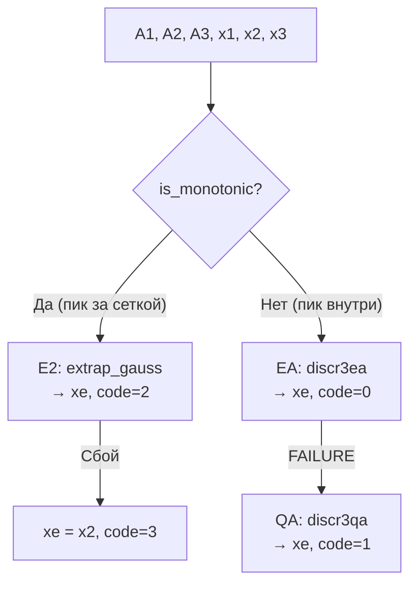

**Коды возврата:**

| Код | Использован метод | Точность |
|-----|-------------------|----------|
| 0 | EA (лучший случай) | MAE ≈ 0.005 |
| 1 | QA fallback | MAE ≈ 0.006 |
| 2 | E2 экстраполяция | MAE ≈ 0.148 |
| 3 | Возврат x2 (сбой E2) | ≤ 0.5 шага |

### 4.4. Сравнение 3pt vs 5pt в монотонной зоне

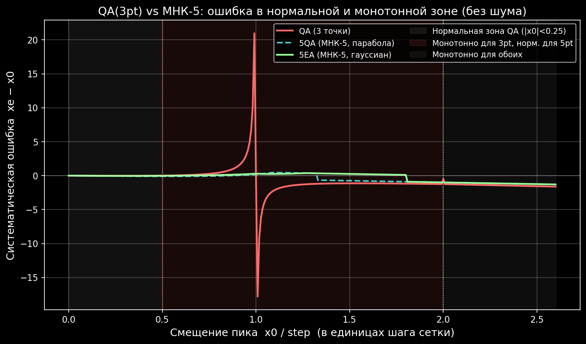

**5EA работает нормально там, где QA(3pt) уже сыплется.** Для QA(3pt) ошибка в монотонной зоне достигает 0.5 и более шага, тогда как 5EA удерживает ошибку в пределах 0.05–0.1 шага за счёт более широкого окна.

Графики: [monotonic_example.png](plots/2_no_noise/monotonic_example.png), [monotonic_bias.png](plots/2_no_noise/monotonic_bias.png), [monotonic_error_vs_snr.png](plots/3_noise/monotonic_error_vs_snr.png)

---

## 5. Сравнение точности дискриминаторов

### 5.1. Экспериментальные данные

Тестирование проведено на функции sinc(x) = sin(x)/x с различными смещениями пика x0 относительно сетки отсчётов. Сетка: 3 точки {-1, 0, +1} (шаг = 1). Смещение x0 варьируется от -0.45 до +0.45.

### 5.2. Таблица точности (нормальная зона, чистый сигнал)

| Метод | Средняя ошибка (MAE) | Макс. ошибка | Число точек | Сложность |
|-------|---------------------|-------------|-------------|-----------|
| CG (центр масс) | 0.172 | ~0.30 | 2-N | Низкая |
| SD (суммарно-разностный) | ~0.15 | ~0.20 | 2 | Низкая |
| QA (квадратичная) | 0.007 | ~0.10 | 3 | Средняя |
| EA (экспоненциальная) | ~0.005 | ~0.05 | 3 | Высокая |
| 5QA (МНК-парабола) | ~0.007 | ~0.10 | 5 | Средняя |
| 5EA (МНК-гауссов) | ~0.003 | ~0.05 | 5 | Высокая |

**Примечание**: данные получены из Python тестов. MAE CG = 0.172, QA = 0.007 подтверждены программно. В монотонной зоне (пик вне окна) все 3-точечные методы имеют ошибки >>0.1 шага.

### 5.3. Интерпретация

- **CG** -- грубая оценка, всегда имеет систематическое смещение при несимметричном расположении пика. Подходит как начальное приближение или при малом числе точек.
- **SD** -- точнее CG, но работает только с 2 точками и требует калибровки коэффициента c. Используется в моноимпульсных системах.
- **QA** -- оптимальный баланс точности и простоты. Ошибка на порядок меньше CG. Рекомендуется для большинства практических случаев.
- **EA** -- максимальная точность, но требует положительных амплитуд и выпуклости (максимум в центре). При нарушении условий возвращает код ошибки.

---

## 6. Графики

Графики сгенерированы Python-скриптами в `test_python/`. Все файлы хранятся в `Doc/plots/`.

### 6.1. Дискриминаторные оценки на sinc(x)

Функция sinc(x - 0.25) с тремя отсчётами на сетке {-1, 0, +1}. Вертикальные линии показывают оценки каждого метода.

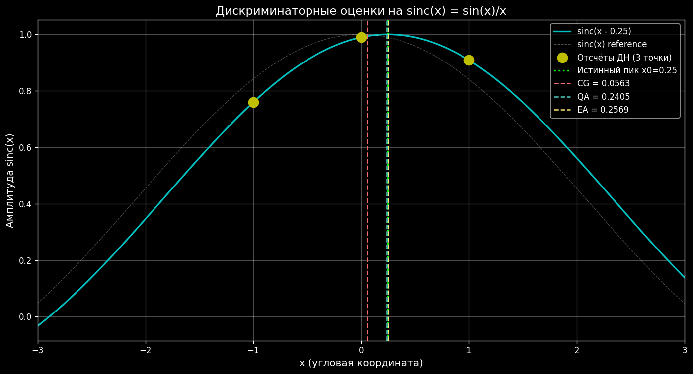

Скрипт: `test_python/test_discriminators_plot.py`

### 6.2. Ошибка оценки vs смещение пика

Абсолютная ошибка |xe - x0| для всех методов при изменении смещения пика от -0.45 до +0.45 (шаг сетки = 1). Логарифмическая ось Y.

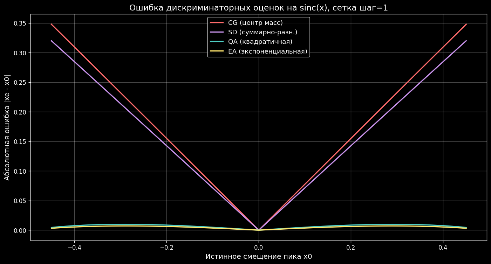

Скрипт: `test_python/analysis/03_plots_2d.py`

### 6.3. МНК 5/7/9 -- сравнение точности

Систематическая ошибка и |ошибка| для МНК-дискриминаторов по 5, 7, 9 точкам на Hanning kernel.

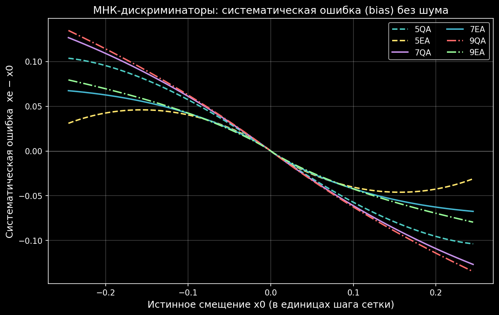
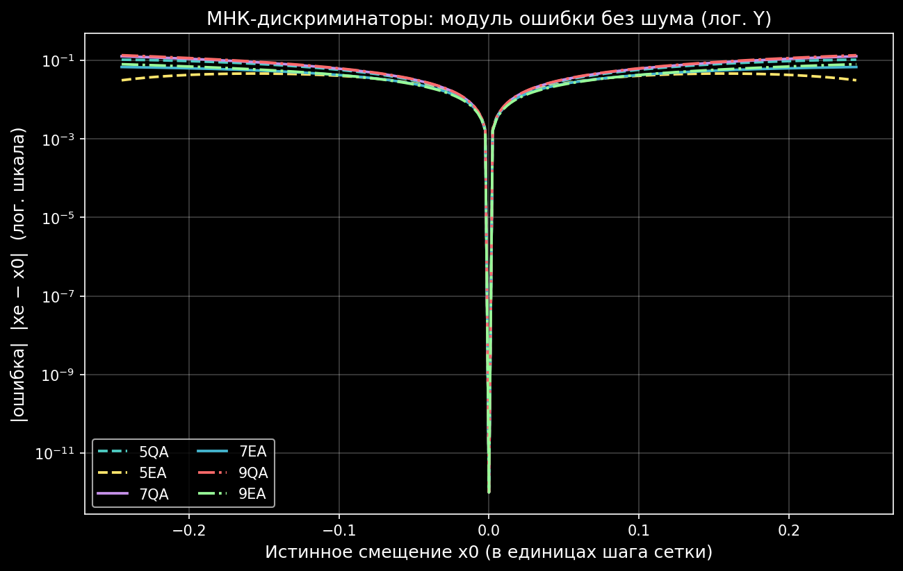

Скрипт: `test_python/analysis/09_lsq_compare.py`

### 6.4. Монотонный режим

Пример нормального vs монотонного сигнала и ошибки методов при пике вне окна.

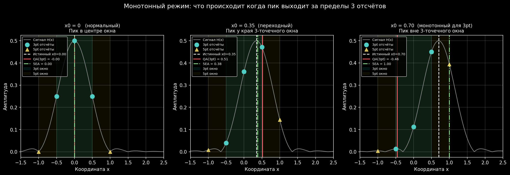


Скрипт: `test_python/analysis/10_monotonic_and_3d.py`

### 6.5. Устойчивость к шуму

Медиана ошибки vs SNR (Монте-Карло).

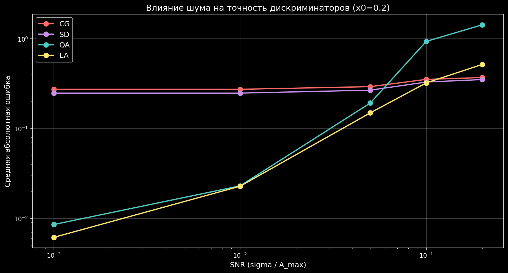
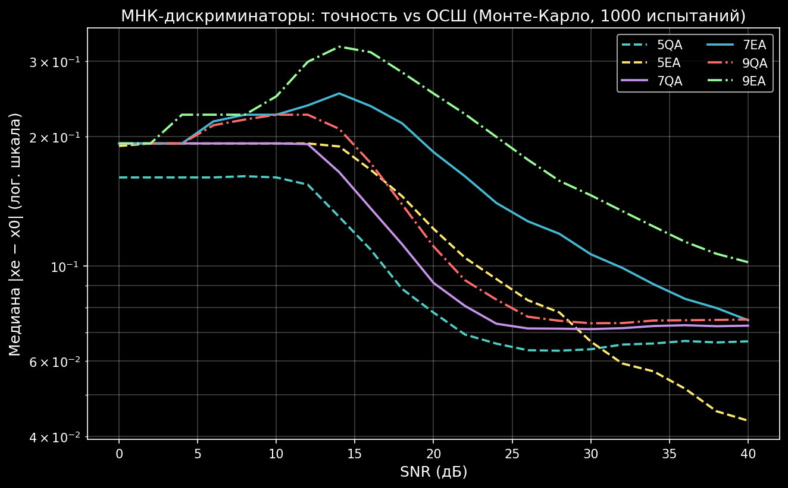
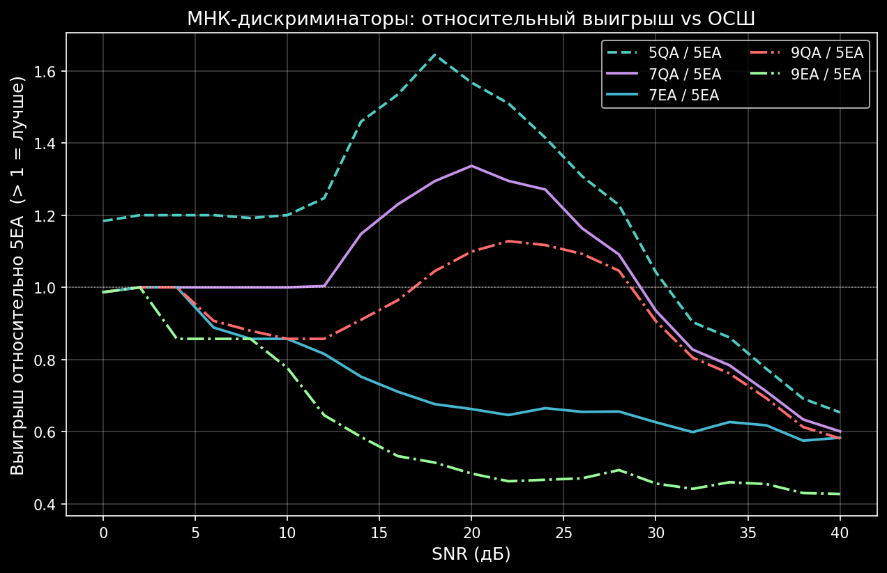

### 6.6. Карты точности (3D)

Ошибка как функция двух параметров (x0, SNR) и (x0, шаг сетки).

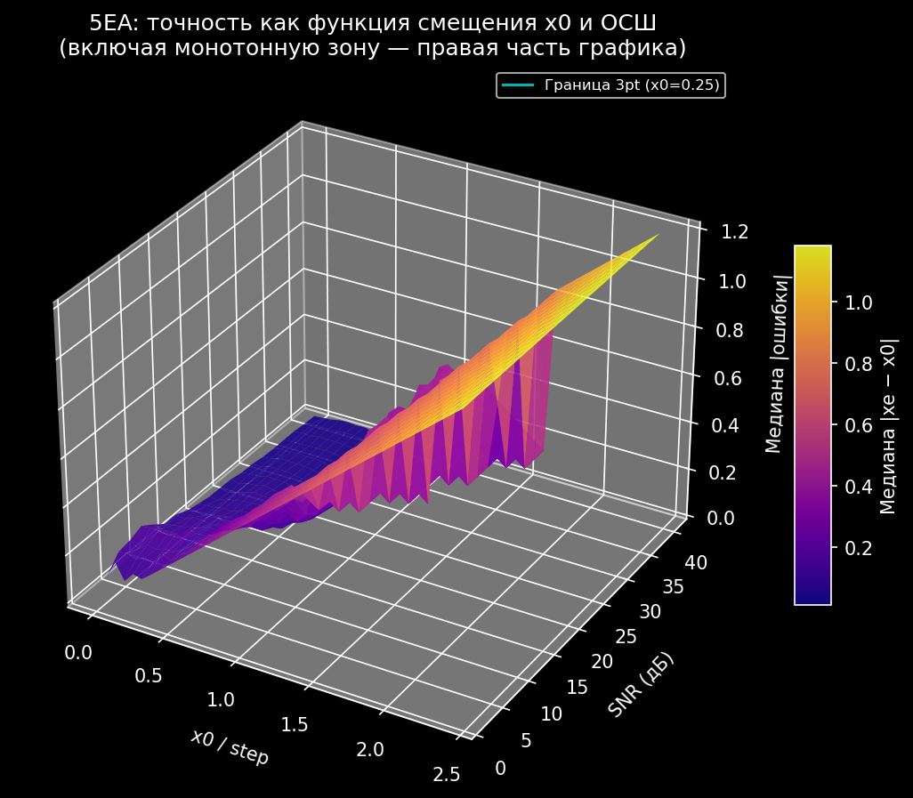
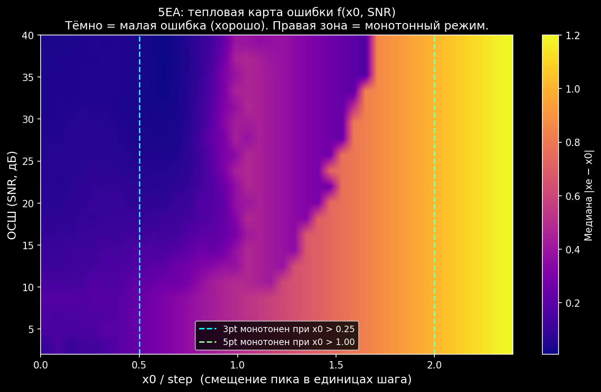
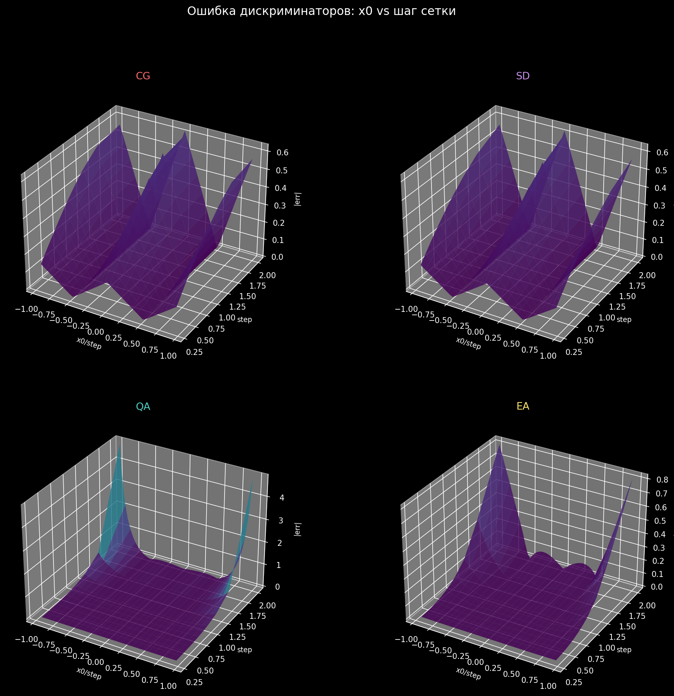

### 6.7. Анимации

GIF-анимации: пик плавно смещается, шум нарастает. Хранятся в `Doc/plots/1_animation/`.

Подробный список и описание всех графиков: **[Doc/plots/README.md](plots/README.md)**

---

## 7. Архитектура модуля

### 7.1. Диаграмма зависимостей

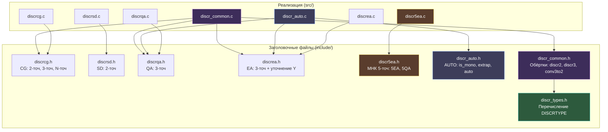

### 7.2. Таблица файлов

| Файл | Назначение | Функций |
|------|-----------|---------|
| `include/discr_types.h` | Перечисление DISCRTYPE (5 типов) | 0 |
| `include/discrcg.h` | Прототипы CG-дискриминатора | 3 |
| `include/discrsd.h` | Прототип SD-дискриминатора | 1 |
| `include/discrqa.h` | Прототип QA-дискриминатора | 1 |
| `include/discrea.h` | Прототипы EA-дискриминатора | 2 |
| `include/discr5ea.h` | Прототипы МНК 5-точечных (5EA, 5QA) | 2 |
| `include/discr_auto.h` | Прототипы AUTO-дискриминатора | 3 |
| `include/discr_common.h` | Прототипы обёрток | 5 |
| `src/discrcg.c` | Реализация CG | 3 |
| `src/discrsd.c` | Реализация SD | 1 |
| `src/discrqa.c` | Реализация QA | 1 |
| `src/discrea.c` | Реализация EA | 3 |
| `src/discr5ea.c` | Реализация МНК 5-точечных | 2+1 (static) |
| `src/discr_auto.c` | Реализация AUTO | 3 |
| `src/discr_common.c` | Обёртки для 2D-матриц ДН | 5 |
| `CMakeLists.txt` | Система сборки | -- |

**Итого**: 17 публичных функций, 8 заголовочных файлов, 7 файлов реализации.

### 7.3. Иерархия вызовов

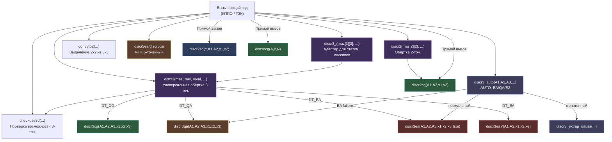

---

## 8. API Reference

Подробное описание каждой функции. Полные Doxygen-комментарии приведены в исходном коде.

### 8.1. CG -- Центр тяжести

#### `discr2cg` -- двухточечный

```c
double discr2cg(double A1, double A2, double x1, double x2);
```

| Параметр | Тип | Описание |
|----------|-----|----------|
| A1 | double | Амплитуда первой точки |
| A2 | double | Амплитуда второй точки |
| x1 | double | Координата первой точки |
| x2 | double | Координата второй точки |
| **return** | double | Оценка координаты максимума |

**Защита**: при A1 + A2 = 0 возвращает (x1 + x2) / 2.

#### `discr3cg` -- трёхточечный

```c
double discr3cg(double A1, double A2, double A3,
                double x1, double x2, double x3);
```

| Параметр | Тип | Описание |
|----------|-----|----------|
| A1, A2, A3 | double | Амплитуды трёх точек |
| x1, x2, x3 | double | Координаты трёх точек |
| **return** | double | Оценка координаты максимума |

**Защита**: при сумме амплитуд = 0 возвращает x2 (центральная точка).

#### `discrncg` -- N-точечный

```c
double discrncg(const double *A, const double *x, unsigned int N);
```

| Параметр | Тип | Описание |
|----------|-----|----------|
| A | const double* | Массив амплитуд (N элементов) |
| x | const double* | Массив координат (N элементов) |
| N | unsigned int | Число точек |
| **return** | double | Оценка координаты максимума |

**Защита**: при сумме = 0 возвращает x[N/2]; при N = 0 возвращает 0.0.

---

### 8.2. SD -- Суммарно-разностный

#### `discr2sd` -- двухточечный

```c
double discr2sd(double c, double A1, double A2,
                double x1, double x2);
```

| Параметр | Тип | Описание |
|----------|-----|----------|
| c | double | Калибровочный коэффициент дискриминатора |
| A1 | double | Амплитуда первой точки |
| A2 | double | Амплитуда второй точки |
| x1 | double | Координата первой точки |
| x2 | double | Координата второй точки |
| **return** | double | Оценка координаты максимума |

**Защита**: при A1 + A2 = 0 возвращает (x1 + x2) / 2.

---

### 8.3. QA -- Квадратичная аппроксимация

#### `discr3qa` -- трёхточечный

```c
double discr3qa(double A1, double A2, double A3,
                double x1, double x2, double x3);
```

| Параметр | Тип | Описание |
|----------|-----|----------|
| A1, A2, A3 | double | Амплитуды трёх точек |
| x1, x2, x3 | double | Координаты трёх точек |
| **return** | double | Оценка координаты максимума |

**Защита**: обработка случаев A1=A2, A2=A3, знаменатель=0 (см. раздел 7).

---

### 8.4. EA -- Экспоненциальная аппроксимация

#### `discr3ea` -- трёхточечный

```c
int discr3ea(double A1, double A2, double A3,
             double x1, double x2, double x3, double *xe);
```

| Параметр | Тип | Описание |
|----------|-----|----------|
| A1, A2, A3 | double | Амплитуды трёх точек (должны быть > 0) |
| x1, x2, x3 | double | Координаты трёх точек |
| xe | double* | [out] Оценка координаты максимума |
| **return** | int | 0 = успех, 1 = ошибка (при ошибке *xe содержит приближение) |

#### `discr3eaY` -- уточнение амплитуды

```c
double discr3eaY(double A1, double A2, double x1, double x2, double xe);
```

| Параметр | Тип | Описание |
|----------|-----|----------|
| A1, A2 | double | Амплитуды двух точек |
| x1, x2 | double | Координаты двух точек |
| xe | double | Ранее вычисленная координата (из discr3ea) |
| **return** | double | Уточнённое значение амплитуды в точке xe |

---

### 8.5. МНК 5-точечные (discr5ea / discr5qa)

Новые функции. Описание формул: раздел 3.2. Описание API: `API.md` раздел "МНК 5-точечные".

```c
int discr5ea(const double A[5], const double x[5], double *xe);
int discr5qa(const double A[5], const double x[5], double *xe);
```

### 8.6. AUTO-дискриминатор (discr_auto)

Новые функции. Описание алгоритма: раздел 4.3. Описание API: `API.md` раздел "Автоматический дискриминатор".

```c
int discr_is_monotonic(double A1, double A2, double A3);
int discr3_extrap_gauss(double A1, double A2, double A3,
                        double x1, double x2, double x3, double *xe);
int discr3_auto(double A1, double A2, double A3,
                double x1, double x2, double x3, double *xe);
```

### 8.7. Обёртки (discr_common)

#### `discr2` -- 2-точечная обёртка для матриц 2x2

```c
int discr2(double maz[2][2], double mel[2][2], double mval[2][2],
           double *az, double *el, double *val);
```

| Параметр | Тип | Описание |
|----------|-----|----------|
| maz | double[2][2] | Азимутальные координаты отсчётов |
| mel | double[2][2] | Угломестные координаты отсчётов |
| mval | double[2][2] | Амплитуды отсчётов |
| az | double* | [out] Уточнённый азимут |
| el | double* | [out] Уточнённый угол места |
| val | double* | [out] Амплитуда максимума |
| **return** | int | 0 = успех, -1 = ошибка |

Находит максимум в матрице 2x2, применяет `discr2cg` по строке (азимут) и столбцу (угол места).

#### `discr3_` -- 3-точечная обёртка для статических массивов 3x3

```c
int discr3_(double maz[3][3], double mel[3][3], double mval[3][3],
            DISCRTYPE discrtype, double dx, double lambda,
            double *az, double *el, double *val);
```

Адаптер: преобразует `double[3][3]` в `double**` и вызывает `discr3()`.

#### `discr3` -- 3-точечная обёртка для динамических массивов

```c
int discr3(double **maz, double **mel, double **mval, int ndnx, int ndny,
           DISCRTYPE discrtype, double dx, double lambda,
           double *az, double *el, double *val);
```

| Параметр | Тип | Описание |
|----------|-----|----------|
| maz | double** | Азимутальные координаты (ndnx x ndny) |
| mel | double** | Угломестные координаты (ndnx x ndny) |
| mval | double** | Амплитуды (ndnx x ndny) |
| ndnx | int | Число ДН по оси X |
| ndny | int | Число ДН по оси Y |
| discrtype | DISCRTYPE | Тип дискриминатора (DT_CG, DT_QA, DT_EA) |
| dx | double | Шаг по углу |
| lambda | double | Длина волны |
| az, el, val | double* | [out] Результат |
| **return** | int | 0 = успех, -1 = нельзя 3-точ., -2 = неизвестный тип |

**Поддерживаемые типы**: DT_CG, DT_QA, DT_EA. Для DT_QA и DT_EA координаты масштабируются коэффициентом c = 2*pi*dx/lambda.

**Важно**: функция НЕ модифицирует входные массивы maz и mel (исправлено в рефакторинге, ERR-003).

#### `checkuse3d` -- проверка возможности 3-точечного дискриминатора

```c
int checkuse3d(double **maz, double **mel, double **mval, int ndnx, int ndny);
```

| **return** | int | 1 = можно использовать 3-точ., 0 = нельзя (есть нулевые амплитуды) |

#### `conv3to2` -- выделение подматрицы 2x2 из 3x3

```c
int conv3to2(double maz3[3][3], double mel3[3][3], double mval3[3][3],
             double maz2[2][2], double mel2[2][2], double mval2[2][2]);
```

Выбирает квадрант 2x2 с максимальной суммарной амплитудой. Используется для **fallback** на 2-точечный дискриминатор, когда 3-точечный невозможен.

| **return** | int | 0 = успех |

---

## 9. Граничные случаи и защита

### 9.1. Исправленные дефекты (рефакторинг)

В ходе рефакторинга исправлены следующие дефекты исходного кода:

| ID | Серьёзность | Описание | Файл | Исправление |
|----|------------|----------|------|-------------|
| ERR-001 | Критическая | Функции `discr2()` и `conv3to2()` объявлены, но не реализованы | discr_common.c | Реализованы |
| ERR-002 | Критическая | Глобальная `static ax[3]` в discrea.c -- нарушение потокобезопасности | discrea.c | Перенесена в локальную переменную |
| ERR-003 | Критическая | `discr3()` модифицирует входные массивы maz, mel (побочный эффект) | discr_common.c | Работа с локальным масштабированием, входные данные не изменяются |
| ERR-004 | Важная | Использование `FLT_EPSILON` вместо `DBL_EPSILON` для double | discrqa.c, discr_common.c | Заменено на `DBL_EPSILON` |
| ERR-005 | Важная | Отсутствие защиты от деления на 0 в CG и SD | discrcg.c, discrsd.c | Добавлены проверки `fabs(sum) < DBL_EPSILON` |
| ERR-006 | Замечание | `discr3()` не поддерживает тип DT_CG | discr_common.c | Добавлена ветка `case DT_CG` |

### 9.2. Деление на ноль (ERR-005)

Все функции, выполняющие деление на сумму амплитуд, защищены:

| Функция | Условие | Поведение при сумме = 0 |
|---------|---------|------------------------|
| `discr2cg` | fabs(A1+A2) < DBL_EPSILON | Возвращает (x1+x2)/2 |
| `discr3cg` | fabs(A1+A2+A3) < DBL_EPSILON | Возвращает x2 |
| `discrncg` | fabs(sum) < DBL_EPSILON | Возвращает x[N/2], при N=0 -- 0.0 |
| `discr2sd` | fabs(A1+A2) < DBL_EPSILON | Возвращает (x1+x2)/2 |
| `discr3qa` | fabs(denom) < DBL_EPSILON | Возвращает x2 |
| `discr3ea` | A < DBL_EPSILON | Возвращает x2, код EXIT_FAILURE |

### 9.3. Потокобезопасность (ERR-002)

**До рефакторинга**: переменная `ax[3]` в `discrea.c` была объявлена как `static` на уровне файла. При одновременном вызове `discr3ea()` из нескольких потоков происходило состояние гонки (race condition).

**После рефакторинга**: переменная `ax[3]` объявлена **локально** внутри функции `discr3ea()`. Каждый вызов работает со своей копией. Все функции модуля теперь **потокобезопасны** (thread-safe).

### 9.4. Побочные эффекты (ERR-003)

**До рефакторинга**: функция `discr3()` умножала входные массивы `maz` и `mel` на коэффициент `c = 2*pi*dx/lambda`. После вызова входные данные оставались изменёнными. Повторный вызов давал неверный результат.

**После рефакторинга**: масштабирование выполняется **при передаче параметров** во внутренние функции (без промежуточных массивов). Входные данные не модифицируются.

---

## 10. Тесты

### 10.1. Обзор тестового покрытия

| Категория | Фреймворк | Файлов | Тестов | Данные |
|-----------|-----------|--------|--------|--------|
| C++ (простые) | assert + iostream | 5 (.hpp) + 1 (.cpp) | 27 | Аналитические + sinc(x) |
| C++ (GTest) | Google Test v1.15.2 | 5 (.cpp) | 40 | sinc(x) = sin(x)/x |
| Python | PyCore.TestRunner | 4 (.py) | 17 классов/методов | sinc(x) + FFT + numpy |

**Итого**: 77+ тестовых проверок.

### 10.2. C++ тесты (простые, без фреймворка)

Расположение: `test_cpp/`

| Файл | Тестов | Что проверяется |
|------|--------|----------------|
| `test_discr_cg.hpp` | 7 | 2-точ, 3-точ, N-точ CG; нулевые амплитуды (ERR-005) |
| `test_discr_sd.hpp` | 3 | Равные амплитуды, смещение, нуль (ERR-005) |
| `test_discr_qa.hpp` | 5 | Симметрия, смещение, все равны, вырожденные случаи |
| `test_discr_ea.hpp` | 6 | Гауссиан центр/смещение, нуль, все равны, вогнутость, уточнение Y |
| `test_discr_common.hpp` | 6 | discr2 (ERR-001), discr3_ без побочных эффектов (ERR-003), DT_CG (ERR-006), checkuse3d, conv3to2 |

Точка входа: `test_cpp/test_main.cpp` -> `all_test.hpp` -> все тесты.

### 10.3. Google Test (GTest)

Расположение: `test_gtest/`

| Файл | Тестов | Что проверяется |
|------|--------|----------------|
| `test_discr_cg_gtest.cpp` | 11 | discr2cg, discr3cg, discrncg на sinc(x) с разными смещениями |
| `test_discr_sd_gtest.cpp` | 5 | discr2sd на sinc(x): симметрия, смещение 0.2 |
| `test_discr_qa_gtest.cpp` | 7 | discr3qa на sinc(x): пик в 0, 0.2, 0.4; мелкая сетка |
| `test_discr_ea_gtest.cpp` | 8 | discr3ea на sinc(x): пик в 0, 0.2; гауссиан; граничные случаи |
| `test_discr_common_gtest.cpp` | 9 | discr2 (ERR-001), discr3_ (ERR-003, ERR-006), sinc(x)*sinc(y) 3x3, checkuse3d, conv3to2 |

Подключение: CMake FetchContent, googletest v1.15.2. Автоматическое обнаружение тестов через `gtest_discover_tests()`.

### 10.4. Python тесты

Расположение: `test_python/`

| Файл | Классов | Что проверяется |
|------|---------|----------------|
| `test_discriminators.py` | 3 | CG на sinc: симметрия, смещение 0.3, 5 точек; QA на sinc: симметрия, смещение 0.2, мелкая сетка; Сравнение CG vs QA |
| `test_discriminators_plot.py` | -- | Генерация 3 графиков (не тест, визуализация) |
| `test_fft_frequency.py` | 3 | FFT-дискриминаторы: sweep, монотонность ДХ, сравнение точности 5 методов (Primer.m) |
| `test_fft_frequency_plot.py` | -- | Генерация 2 графиков FFT (3x3 фигура Primer.m + ошибка EXP с окнами) |

Тесты используют **numpy** как эталон и **PyCore.TestRunner** с **DataValidator** для валидации.

### 10.5. FFT-дискриминаторы частоты (из Primer.m)

Дополнительный набор тестов проверяет работу дискриминаторов в задаче **оценки частоты
по FFT-спектру** комплексного сигнала (воспроизведение MatLab Primer.m + fcalcdelay.m).

**Сигнал**: `x(t) = exp(j·2pi·fsin·t)`, N=32, fd=12 МГц, окно Хэмминга.

**5 методов** (порт из C-исходников + fcalcdelay.m):

| Метод | Тип | Формула | Исходник |
|-------|-----|---------|----------|
| exp | 3-точ. | парабола на log\|S\| | discr3ea.c |
| sqr | 3-точ. | парабола на \|S\| (Ao) | discr3qa.c |
| lay | 3-точ. | Jacobsen: `-Re{(Sp-Sm)/(2S0-Sm-Sp)}·fd/N` | fcalcdelay.m |
| sd | 2-точ. | `(x1+x2)/2 + c·(A2-A1)/(A2+A1)`, c=0.132497 | discrsd.c |
| cg | 2-точ. | `(A1·x1+A2·x2)/(A1+A2)` | discrcg.c |

**Таблица точности** (sweep ±df/4, N=32, Hamming):

```
Метод | Средняя ошибка | Макс. ошибка
------+----------------+-------------
exp   |       2 902 Hz |    4 825 Hz   <-- лучший
sqr   |      13 553 Hz |   23 348 Hz
lay   |      22 933 Hz |   43 811 Hz
sd    |     138 393 Hz |  187 500 Hz   <-- грубая оценка
cg    |      84 664 Hz |  115 270 Hz
```

**Графики** (Doc/plots/):
- `fft_primer_m.png` — 3×3 фигура: спектры + оценки + ошибки (как Primer.m)
- `fft_exp_error_windows.png` — ошибка EXP: все методы + сравнение окон

```bash
# Запуск:
python test_python/test_fft_frequency.py       # 10 тестов
python test_python/test_fft_frequency_plot.py   # 2 графика -> Doc/plots/
```

### 10.6. Экспериментальные данные

Все тесты используют функцию sinc(x) = sin(x)/x как модель ДН антенны:

- **Симметричные случаи**: sinc(x) с пиком в 0, отсчёты {-1, 0, +1} или {-0.5, 0, +0.5}
- **Смещённые случаи**: sinc(x - x0), x0 = 0.2, 0.3, 0.4 -- проверка точности при несовпадении пика с сеткой
- **Гауссовы данные**: exp(-x²) -- идеальные данные для EA-дискриминатора
- **Вырожденные случаи**: нулевые амплитуды, все равные, вогнутость (монотонный рост 2,4,8)
- **2D-данные**: sinc(x)*sinc(y) на сетке 3x3 -- для тестирования обёрток discr3_, discr2

---

## 11. Сборка и запуск

### 11.1. Требования

- **Компилятор**: GCC >= 7 (C17/C++17) или MSVC >= 2019
- **CMake**: >= 3.15
- **Python**: >= 3.8 (для Python тестов)
- **Библиотеки Python**: numpy, matplotlib, scipy (для графиков)
- **Интернет**: для первой сборки GTest (FetchContent загрузит googletest)

### 11.2. Сборка (GCC / MinGW)

```bash
cd discriminator_estimates
mkdir build && cd build
cmake .. -G "MinGW Makefiles"
cmake --build .
```

Результат:
- `libdiscr.a` -- статическая библиотека
- `discr.dll` (Windows) или `libdiscr.so` (Linux) -- shared-библиотека (для Python ctypes)
- `test_discr` -- C++ тесты (простые)
- `test_discr_gtest` -- Google Test тесты

### 11.3. Сборка (MSVC / Visual Studio)

```bash
cd discriminator_estimates
mkdir build && cd build
cmake .. -G "Visual Studio 17 2022"
cmake --build . --config Release
```

### 11.4. Запуск C++ тестов

```bash
# Простые тесты
./build/test_discr

# Google Test
./build/test_discr_gtest

# Через CTest (все тесты)
cd build && ctest --output-on-failure
```

### 11.5. Запуск Python тестов

```bash
# Из корня модуля discriminator_estimates:
python test_python/test_discriminators.py

# Генерация графиков (сохраняются в Doc/plots/):
python test_python/test_discriminators_plot.py
```

**Примечание**: Python тесты используют `PyCore.TestRunner` из корня репозитория. Убедитесь, что каталог `PyCore/` доступен.

---

## 12. Источники

1. **Skolnik M.I.** Introduction to Radar Systems. McGraw-Hill, 3rd ed., 2001. -- Глава 9: Tracking Radar. Раздел 9.3: Monopulse tracking (суммарно-разностный метод).

2. **Ширман Я.Д.** Радиоэлектронные системы: основы построения и теория. Справочник. Москва: Радиотехника, 2007. -- Глава 14: Методы измерения координат в РЛС. Дискриминаторные оценки.

3. **Barton D.K.** Modern Radar System Analysis. Artech House, 1988. -- Раздел: Interpolation methods for angle estimation.

4. **Blair W.D., Brandt-Pearce M.** "Monopulse DOA estimation of two unresolved Rayleigh targets". IEEE Trans. Aerospace and Electronic Systems, Vol. 37, No. 2, 2001. -- Теория суммарно-разностной оценки для двух целей.

5. **Документация НИИДАР**: Керский Е.В. "Комплекс программ первичной обработки (КППО). Программа вычисления текущих замеров координат (ТЗК)." Внутренний документ, 2017.

---

*Документ обновлён: Кодо (AI-ассистент), 2026-04-06*
*Версия 1.1: добавлены МНК 5/7/9, AUTO-дискриминатор, монотонный режим, Hanning kernel*
*Для: заказчик / руководство проекта*
*Модуль: discriminator_estimates v1.1*
