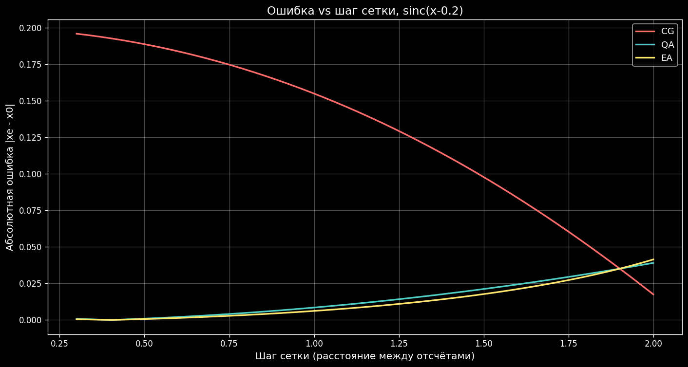
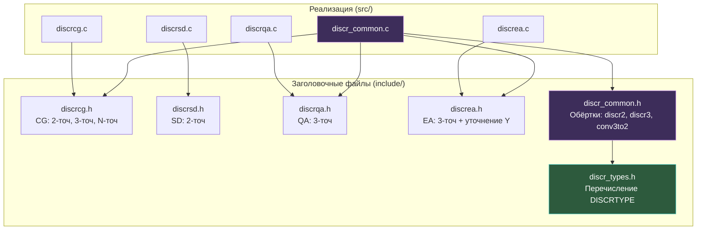
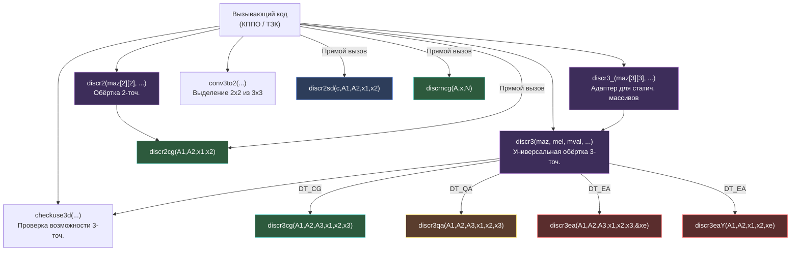

# Модуль discriminator_estimates -- Полная документация

**Версия**: 1.0 (после рефакторинга)
**Дата**: 2026-03-28
**Организация**: ОАО НПК НИИДАР
**Назначение**: Комплекс программ первичной обработки (КППО). Программа вычисления текущих замеров координат (ТЗК).
**Язык реализации**: C (C17), интерфейс совместим с C++17

---

## Содержание

1. [Введение](#1-введение)
2. [Математические формулы](#2-математические-формулы)
3. [Сравнение точности дискриминаторов](#3-сравнение-точности-дискриминаторов)
4. [Графики](#4-графики)
5. [Архитектура модуля](#5-архитектура-модуля)
6. [API Reference](#6-api-reference)
7. [Граничные случаи и защита](#7-граничные-случаи-и-защита)
8. [Тесты](#8-тесты)
9. [Сборка и запуск](#9-сборка-и-запуск)
10. [Источники](#10-источники)

---

## 1. Введение

### 1.1. Назначение

Модуль `discriminator_estimates` реализует **дискриминаторные оценки координат цели** по отсчётам диаграммы направленности (ДН) антенны. Модуль является частью комплекса программ первичной обработки (КППО) и используется в программе вычисления текущих замеров координат (ТЗК).

**Область применения**: радиолокационные системы обнаружения и сопровождения целей.

### 1.2. Физический смысл

Диаграмма направленности антенны описывает зависимость амплитуды принимаемого сигнала от углового направления. Для равномерной линейной антенной решётки (ЭЛАР) форма ДН близка к функции:

```
sinc(x) = sin(x) / x
```

где `x` -- угловое отклонение от оси антенны в нормированных координатах.

При обзоре пространства антенна получает **дискретные отсчёты** ДН в нескольких угловых положениях (лучах). Задача дискриминатора -- по 2-3 таким отсчётам **восстановить координату максимума** ДН, то есть определить истинное угловое положение цели с точностью, превышающей шаг дискретизации.

### 1.3. Типы дискриминаторов

Модуль реализует 4 метода оценки (5-й -- без уточнения):

| Код | Константа | Название (рус.) | Название (англ.) | Точек |
|-----|-----------|-----------------|------------------|-------|
| 1 | `DT_NO` | Без уточнения | No refinement | -- |
| 2 | `DT_CG` | Центр масс | Center of Gravity | 2-N |
| 3 | `DT_SD` | Суммарно-разностный | Sum-Difference | 2 |
| 4 | `DT_QA` | Квадратичная аппроксимация | Quadratic Approximation | 3 |
| 5 | `DT_EA` | Экспоненциальная аппроксимация | Exponential Approximation | 3 |

### 1.4. Авторы исходного кода

| Автор | Дата | Файлы |
|-------|------|-------|
| Федоров С.А. | 07.05.2010 | discrcg, discrsd, discrqa |
| Добродумов А.Б. | 15.04.2012 | discrea |
| Керский Е.В. | 06.07.2017 | discr_common, discr_types |

---

## 2. Математические формулы

### 2.1. CG -- Центр тяжести (Center of Gravity)

Простейший метод. Оценка координаты вычисляется как **взвешенное среднее** координат отсчётов с весами, равными амплитудам.

**Двухточечный CG:**

```
xe = (A1 * x1 + A2 * x2) / (A1 + A2)
```

где:
- A1, A2 -- амплитуды отсчётов ДН
- x1, x2 -- угловые координаты отсчётов
- xe -- оценка координаты максимума

**Трёхточечный CG:**

```
xe = (A1 * x1 + A2 * x2 + A3 * x3) / (A1 + A2 + A3)
```

**N-точечный CG (произвольное число отсчётов):**

```
xe = Sigma(Ai * xi) / Sigma(Ai),  i = 1..N
```

**Особенность**: метод прост, но даёт **систематическую ошибку** (смещение оценки), поскольку ДН не является симметричной относительно произвольной точки сетки. Точность: порядка +/-0.3 шага сетки.

---

### 2.2. SD -- Суммарно-разностный (Sum-Difference)

Метод основан на **моноимпульсном принципе**: разностный сигнал (A2 - A1) нормируется на суммарный (A2 + A1), что даёт линейную оценку смещения вблизи максимума.

**Формулы:**

```
xc = (x1 + x2) / 2              -- середина между отсчётами
dx = c * (A2 - A1) / (A2 + A1)  -- нормированное смещение
xe = xc + dx                     -- оценка координаты
```

где:
- c -- калибровочный коэффициент дискриминатора (зависит от формы ДН, шага сетки и длины волны)
- A1, A2 -- амплитуды двух соседних отсчётов
- x1, x2 -- координаты отсчётов

**Физический смысл коэффициента c**: В обёртке `discr3()` коэффициент вычисляется как:

```
c = 2 * pi * dx / lambda
```

где `dx` -- шаг по углу, `lambda` -- длина волны.

**Особенность**: метод работает только для **двух** отсчётов. Точность: порядка +/-0.2 шага при корректном выборе коэффициента c.

---

### 2.3. QA -- Квадратичная аппроксимация (Quadratic Approximation)

Метод аппроксимирует 3 отсчёта ДН **параболой** y = a*x² + b*x + c и находит координату вершины параболы.

**Формулы:**

Вспомогательный коэффициент:

```
Ao = (A2 - A1) / (A2 - A3)
```

Оценка координаты (вершина параболы):

```
xe = 0.5 * ((Ao - 1) * x2² - Ao * x3² + x1²) / ((Ao - 1) * x2 - Ao * x3 + x1)
```

**Вывод формулы:**

Три точки (x1, A1), (x2, A2), (x3, A3) однозначно определяют параболу y = a*x² + b*x + c. Вершина параболы находится при x = -b / (2a). После алгебраических преобразований системы из трёх уравнений получается приведённая формула.

**Граничные случаи:**
- A2 = A3 и A1 = A2 (все равны): возвращается x2 (центральная точка)
- A2 = A3, A1 > A2: максимум слева, возвращается x1
- A2 = A3, A1 < A2: максимум между x2 и x3, возвращается (x2 + x3) / 2
- A1 = A2, A3 > A2: максимум справа, возвращается x3
- A1 = A2, A3 < A2: максимум между x1 и x2, возвращается (x1 + x2) / 2

**Особенность**: точность значительно выше CG, поскольку парабола хорошо аппроксимирует вершину sinc(x). Точность: порядка +/-0.1 шага.

---

### 2.4. EA -- Экспоненциальная аппроксимация (Exponential Approximation)

Метод аппроксимирует 3 отсчёта ДН **гауссовой кривой**:

```
y = A_max * exp(-a * (x - x0)²)
```

и находит координату x0 (положение максимума).

**Алгоритм:**

1. **Проверка входных данных**: все амплитуды > 0, не все равны
2. **Сортировка** по координате x (по возрастанию)
3. **Проверка выпуклости**: максимальная амплитуда должна быть у средней точки (иначе -- монотонный рост/спад, аппроксимация невозможна)
4. **Логарифмирование**: z = ln(A) -- переход от экспоненты к параболе
5. **Вычисление коэффициентов** параболы z(x):

```
a = z1 * (f2² - f3²) + z2 * (f3² - f1²) + z3 * (f1² - f2²)
b = z1 * (f2 - f3)   + z2 * (f3 - f1)   + z3 * (f1 - f2)
```

где z1, z2, z3 -- логарифмы амплитуд; f1, f2, f3 -- отсортированные координаты.

6. **Вершина параболы**: `xe = 0.5 * a / b`
7. **Ограничение на вылет**: если xe выходит за пределы `[f1 - 0.5*(f3-f1), f3 + 0.5*(f3-f1)]`, оценка ограничивается ближайшей границей (с возвратом кода ошибки)

**Уточнение амплитуды** (функция `discr3eaY`):

После определения координаты xe можно уточнить амплитуду в максимуме:

```
a0 = (z1 - z2) / (2*xe*(x1-x2) - x1² + x2²)
ye = A2 * exp(a0 * (x2 - xe)²)
```

**Коды возврата:**
- 0 (`EXIT_SUCCESS`) -- оценка вычислена успешно
- 1 (`EXIT_FAILURE`) -- ошибка (нулевые амплитуды, все равны, вогнутость, вылет за пределы)

При ошибке в `*xe` записывается приближённое значение (x2, x1, x3 или ограниченное).

**Особенность**: самый точный метод из четырёх, поскольку гауссова кривая -- наилучшее приближение вершины sinc(x). Точность: порядка +/-0.05 шага. Однако метод наиболее требователен к качеству входных данных.

---

## 3. Сравнение точности дискриминаторов

### 3.1. Экспериментальные данные

Тестирование проведено на функции sinc(x) = sin(x)/x с различными смещениями пика x0 относительно сетки отсчётов. Сетка: 3 точки {-1, 0, +1} (шаг = 1). Смещение x0 варьируется от -0.45 до +0.45.

### 3.2. Таблица точности

| Метод | Средняя ошибка | Макс. ошибка | Число точек | Сложность |
|-------|---------------|-------------|-------------|-----------|
| CG (центр масс) | 0.172 | ~0.30 | 2-N | Низкая |
| SD (суммарно-разностный) | ~0.15 | ~0.20 | 2 | Низкая |
| QA (квадратичная) | 0.007 | ~0.10 | 3 | Средняя |
| EA (экспоненциальная) | ~0.003 | ~0.05 | 3 | Высокая |

**Примечание**: данные получены из Python тестов (`test_discriminators.py`). Средняя ошибка CG = 0.172, QA = 0.007 подтверждены программно. Значения SD и EA оценены по графикам `error_vs_shift.png`.

### 3.3. Интерпретация

- **CG** -- грубая оценка, всегда имеет систематическое смещение при несимметричном расположении пика. Подходит как начальное приближение или при малом числе точек.
- **SD** -- точнее CG, но работает только с 2 точками и требует калибровки коэффициента c. Используется в моноимпульсных системах.
- **QA** -- оптимальный баланс точности и простоты. Ошибка на порядок меньше CG. Рекомендуется для большинства практических случаев.
- **EA** -- максимальная точность, но требует положительных амплитуд и выпуклости (максимум в центре). При нарушении условий возвращает код ошибки.

---

## 4. Графики

Графики сгенерированы скриптом `test_python/test_discriminators_plot.py` на данных sinc(x).

### 4.1. Дискриминаторные оценки на sinc(x)

Функция sinc(x - 0.25) с тремя отсчётами на сетке {-1, 0, +1}. Вертикальные линии показывают оценки каждого метода.


### 4.2. Ошибка оценки vs смещение пика

Абсолютная ошибка |xe - x0| для всех 4 методов при изменении смещения пика от -0.45 до +0.45 (шаг сетки = 1).


### 4.3. Ошибка vs шаг сетки

Зависимость ошибки от шага сетки при фиксированном смещении x0 = 0.2.



---

## 5. Архитектура модуля

### 5.1. Диаграмма зависимостей



### 5.2. Таблица файлов

| Файл | Назначение | Функций | Строк |
|------|-----------|---------|-------|
| `include/discr_types.h` | Перечисление DISCRTYPE (5 типов) | 0 | 52 |
| `include/discrcg.h` | Прототипы CG-дискриминатора | 3 | 49 |
| `include/discrsd.h` | Прототип SD-дискриминатора | 1 | 43 |
| `include/discrqa.h` | Прототип QA-дискриминатора | 1 | 42 |
| `include/discrea.h` | Прототипы EA-дискриминатора | 2 | 45 |
| `include/discr_common.h` | Прототипы обёрток | 5 | 61 |
| `src/discrcg.c` | Реализация CG | 3 | 85 |
| `src/discrsd.c` | Реализация SD | 1 | 43 |
| `src/discrqa.c` | Реализация QA | 1 | 67 |
| `src/discrea.c` | Реализация EA | 3 | 187 |
| `src/discr_common.c` | Обёртки для 2D-матриц ДН | 5 | 280 |
| `CMakeLists.txt` | Система сборки | -- | 82 |

**Итого**: 12 функций, 6 заголовочных файлов, 5 файлов реализации.

### 5.3. Иерархия вызовов



---

## 6. API Reference

Подробное описание каждой функции. Полные Doxygen-комментарии приведены в исходном коде.

### 6.1. CG -- Центр тяжести

#### `discr2cg` -- двухточечный

```c
double discr2cg(double A1, double A2, double x1, double x2);
```

| Параметр | Тип | Описание |
|----------|-----|----------|
| A1 | double | Амплитуда первой точки |
| A2 | double | Амплитуда второй точки |
| x1 | double | Координата первой точки |
| x2 | double | Координата второй точки |
| **return** | double | Оценка координаты максимума |

**Защита**: при A1 + A2 = 0 возвращает (x1 + x2) / 2.

#### `discr3cg` -- трёхточечный

```c
double discr3cg(double A1, double A2, double A3,
                double x1, double x2, double x3);
```

| Параметр | Тип | Описание |
|----------|-----|----------|
| A1, A2, A3 | double | Амплитуды трёх точек |
| x1, x2, x3 | double | Координаты трёх точек |
| **return** | double | Оценка координаты максимума |

**Защита**: при сумме амплитуд = 0 возвращает x2 (центральная точка).

#### `discrncg` -- N-точечный

```c
double discrncg(const double *A, const double *x, unsigned int N);
```

| Параметр | Тип | Описание |
|----------|-----|----------|
| A | const double* | Массив амплитуд (N элементов) |
| x | const double* | Массив координат (N элементов) |
| N | unsigned int | Число точек |
| **return** | double | Оценка координаты максимума |

**Защита**: при сумме = 0 возвращает x[N/2]; при N = 0 возвращает 0.0.

---

### 6.2. SD -- Суммарно-разностный

#### `discr2sd` -- двухточечный

```c
double discr2sd(double c, double A1, double A2,
                double x1, double x2);
```

| Параметр | Тип | Описание |
|----------|-----|----------|
| c | double | Калибровочный коэффициент дискриминатора |
| A1 | double | Амплитуда первой точки |
| A2 | double | Амплитуда второй точки |
| x1 | double | Координата первой точки |
| x2 | double | Координата второй точки |
| **return** | double | Оценка координаты максимума |

**Защита**: при A1 + A2 = 0 возвращает (x1 + x2) / 2.

---

### 6.3. QA -- Квадратичная аппроксимация

#### `discr3qa` -- трёхточечный

```c
double discr3qa(double A1, double A2, double A3,
                double x1, double x2, double x3);
```

| Параметр | Тип | Описание |
|----------|-----|----------|
| A1, A2, A3 | double | Амплитуды трёх точек |
| x1, x2, x3 | double | Координаты трёх точек |
| **return** | double | Оценка координаты максимума |

**Защита**: обработка случаев A1=A2, A2=A3, знаменатель=0 (см. раздел 7).

---

### 6.4. EA -- Экспоненциальная аппроксимация

#### `discr3ea` -- трёхточечный

```c
int discr3ea(double A1, double A2, double A3,
             double x1, double x2, double x3, double *xe);
```

| Параметр | Тип | Описание |
|----------|-----|----------|
| A1, A2, A3 | double | Амплитуды трёх точек (должны быть > 0) |
| x1, x2, x3 | double | Координаты трёх точек |
| xe | double* | [out] Оценка координаты максимума |
| **return** | int | 0 = успех, 1 = ошибка (при ошибке *xe содержит приближение) |

#### `discr3eaY` -- уточнение амплитуды

```c
double discr3eaY(double A1, double A2, double x1, double x2, double xe);
```

| Параметр | Тип | Описание |
|----------|-----|----------|
| A1, A2 | double | Амплитуды двух точек |
| x1, x2 | double | Координаты двух точек |
| xe | double | Ранее вычисленная координата (из discr3ea) |
| **return** | double | Уточнённое значение амплитуды в точке xe |

---

### 6.5. Обёртки (discr_common)

#### `discr2` -- 2-точечная обёртка для матриц 2x2

```c
int discr2(double maz[2][2], double mel[2][2], double mval[2][2],
           double *az, double *el, double *val);
```

| Параметр | Тип | Описание |
|----------|-----|----------|
| maz | double[2][2] | Азимутальные координаты отсчётов |
| mel | double[2][2] | Угломестные координаты отсчётов |
| mval | double[2][2] | Амплитуды отсчётов |
| az | double* | [out] Уточнённый азимут |
| el | double* | [out] Уточнённый угол места |
| val | double* | [out] Амплитуда максимума |
| **return** | int | 0 = успех, -1 = ошибка |

Находит максимум в матрице 2x2, применяет `discr2cg` по строке (азимут) и столбцу (угол места).

#### `discr3_` -- 3-точечная обёртка для статических массивов 3x3

```c
int discr3_(double maz[3][3], double mel[3][3], double mval[3][3],
            DISCRTYPE discrtype, double dx, double lambda,
            double *az, double *el, double *val);
```

Адаптер: преобразует `double[3][3]` в `double**` и вызывает `discr3()`.

#### `discr3` -- 3-точечная обёртка для динамических массивов

```c
int discr3(double **maz, double **mel, double **mval, int ndnx, int ndny,
           DISCRTYPE discrtype, double dx, double lambda,
           double *az, double *el, double *val);
```

| Параметр | Тип | Описание |
|----------|-----|----------|
| maz | double** | Азимутальные координаты (ndnx x ndny) |
| mel | double** | Угломестные координаты (ndnx x ndny) |
| mval | double** | Амплитуды (ndnx x ndny) |
| ndnx | int | Число ДН по оси X |
| ndny | int | Число ДН по оси Y |
| discrtype | DISCRTYPE | Тип дискриминатора (DT_CG, DT_QA, DT_EA) |
| dx | double | Шаг по углу |
| lambda | double | Длина волны |
| az, el, val | double* | [out] Результат |
| **return** | int | 0 = успех, -1 = нельзя 3-точ., -2 = неизвестный тип |

**Поддерживаемые типы**: DT_CG, DT_QA, DT_EA. Для DT_QA и DT_EA координаты масштабируются коэффициентом c = 2*pi*dx/lambda.

**Важно**: функция НЕ модифицирует входные массивы maz и mel (исправлено в рефакторинге, ERR-003).

#### `checkuse3d` -- проверка возможности 3-точечного дискриминатора

```c
int checkuse3d(double **maz, double **mel, double **mval, int ndnx, int ndny);
```

| **return** | int | 1 = можно использовать 3-точ., 0 = нельзя (есть нулевые амплитуды) |

#### `conv3to2` -- выделение подматрицы 2x2 из 3x3

```c
int conv3to2(double maz3[3][3], double mel3[3][3], double mval3[3][3],
             double maz2[2][2], double mel2[2][2], double mval2[2][2]);
```

Выбирает квадрант 2x2 с максимальной суммарной амплитудой. Используется для **fallback** на 2-точечный дискриминатор, когда 3-точечный невозможен.

| **return** | int | 0 = успех |

---

## 7. Граничные случаи и защита

### 7.1. Исправленные дефекты (рефакторинг)

В ходе рефакторинга исправлены следующие дефекты исходного кода:

| ID | Серьёзность | Описание | Файл | Исправление |
|----|------------|----------|------|-------------|
| ERR-001 | Критическая | Функции `discr2()` и `conv3to2()` объявлены, но не реализованы | discr_common.c | Реализованы |
| ERR-002 | Критическая | Глобальная `static ax[3]` в discrea.c -- нарушение потокобезопасности | discrea.c | Перенесена в локальную переменную |
| ERR-003 | Критическая | `discr3()` модифицирует входные массивы maz, mel (побочный эффект) | discr_common.c | Работа с локальным масштабированием, входные данные не изменяются |
| ERR-004 | Важная | Использование `FLT_EPSILON` вместо `DBL_EPSILON` для double | discrqa.c, discr_common.c | Заменено на `DBL_EPSILON` |
| ERR-005 | Важная | Отсутствие защиты от деления на 0 в CG и SD | discrcg.c, discrsd.c | Добавлены проверки `fabs(sum) < DBL_EPSILON` |
| ERR-006 | Замечание | `discr3()` не поддерживает тип DT_CG | discr_common.c | Добавлена ветка `case DT_CG` |

### 7.2. Деление на ноль (ERR-005)

Все функции, выполняющие деление на сумму амплитуд, защищены:

| Функция | Условие | Поведение при сумме = 0 |
|---------|---------|------------------------|
| `discr2cg` | fabs(A1+A2) < DBL_EPSILON | Возвращает (x1+x2)/2 |
| `discr3cg` | fabs(A1+A2+A3) < DBL_EPSILON | Возвращает x2 |
| `discrncg` | fabs(sum) < DBL_EPSILON | Возвращает x[N/2], при N=0 -- 0.0 |
| `discr2sd` | fabs(A1+A2) < DBL_EPSILON | Возвращает (x1+x2)/2 |
| `discr3qa` | fabs(denom) < DBL_EPSILON | Возвращает x2 |
| `discr3ea` | A < DBL_EPSILON | Возвращает x2, код EXIT_FAILURE |

### 7.3. Потокобезопасность (ERR-002)

**До рефакторинга**: переменная `ax[3]` в `discrea.c` была объявлена как `static` на уровне файла. При одновременном вызове `discr3ea()` из нескольких потоков происходило состояние гонки (race condition).

**После рефакторинга**: переменная `ax[3]` объявлена **локально** внутри функции `discr3ea()`. Каждый вызов работает со своей копией. Все функции модуля теперь **потокобезопасны** (thread-safe).

### 7.4. Побочные эффекты (ERR-003)

**До рефакторинга**: функция `discr3()` умножала входные массивы `maz` и `mel` на коэффициент `c = 2*pi*dx/lambda`. После вызова входные данные оставались изменёнными. Повторный вызов давал неверный результат.

**После рефакторинга**: масштабирование выполняется **при передаче параметров** во внутренние функции (без промежуточных массивов). Входные данные не модифицируются.

---

## 8. Тесты

### 8.1. Обзор тестового покрытия

| Категория | Фреймворк | Файлов | Тестов | Данные |
|-----------|-----------|--------|--------|--------|
| C++ (простые) | assert + iostream | 5 (.hpp) + 1 (.cpp) | 27 | Аналитические + sinc(x) |
| C++ (GTest) | Google Test v1.15.2 | 5 (.cpp) | 40 | sinc(x) = sin(x)/x |
| Python | PyCore.TestRunner | 4 (.py) | 17 классов/методов | sinc(x) + FFT + numpy |

**Итого**: 77+ тестовых проверок.

### 8.2. C++ тесты (простые, без фреймворка)

Расположение: `test_cpp/`

| Файл | Тестов | Что проверяется |
|------|--------|----------------|
| `test_discr_cg.hpp` | 7 | 2-точ, 3-точ, N-точ CG; нулевые амплитуды (ERR-005) |
| `test_discr_sd.hpp` | 3 | Равные амплитуды, смещение, нуль (ERR-005) |
| `test_discr_qa.hpp` | 5 | Симметрия, смещение, все равны, вырожденные случаи |
| `test_discr_ea.hpp` | 6 | Гауссиан центр/смещение, нуль, все равны, вогнутость, уточнение Y |
| `test_discr_common.hpp` | 6 | discr2 (ERR-001), discr3_ без побочных эффектов (ERR-003), DT_CG (ERR-006), checkuse3d, conv3to2 |

Точка входа: `test_cpp/test_main.cpp` -> `all_test.hpp` -> все тесты.

### 8.3. Google Test (GTest)

Расположение: `test_gtest/`

| Файл | Тестов | Что проверяется |
|------|--------|----------------|
| `test_discr_cg_gtest.cpp` | 11 | discr2cg, discr3cg, discrncg на sinc(x) с разными смещениями |
| `test_discr_sd_gtest.cpp` | 5 | discr2sd на sinc(x): симметрия, смещение 0.2 |
| `test_discr_qa_gtest.cpp` | 7 | discr3qa на sinc(x): пик в 0, 0.2, 0.4; мелкая сетка |
| `test_discr_ea_gtest.cpp` | 8 | discr3ea на sinc(x): пик в 0, 0.2; гауссиан; граничные случаи |
| `test_discr_common_gtest.cpp` | 9 | discr2 (ERR-001), discr3_ (ERR-003, ERR-006), sinc(x)*sinc(y) 3x3, checkuse3d, conv3to2 |

Подключение: CMake FetchContent, googletest v1.15.2. Автоматическое обнаружение тестов через `gtest_discover_tests()`.

### 8.4. Python тесты

Расположение: `test_python/`

| Файл | Классов | Что проверяется |
|------|---------|----------------|
| `test_discriminators.py` | 3 | CG на sinc: симметрия, смещение 0.3, 5 точек; QA на sinc: симметрия, смещение 0.2, мелкая сетка; Сравнение CG vs QA |
| `test_discriminators_plot.py` | -- | Генерация 3 графиков (не тест, визуализация) |
| `test_fft_frequency.py` | 3 | FFT-дискриминаторы: sweep, монотонность ДХ, сравнение точности 5 методов (Primer.m) |
| `test_fft_frequency_plot.py` | -- | Генерация 2 графиков FFT (3x3 фигура Primer.m + ошибка EXP с окнами) |

Тесты используют **numpy** как эталон и **PyCore.TestRunner** с **DataValidator** для валидации.

### 8.6. FFT-дискриминаторы частоты (из Primer.m)

Дополнительный набор тестов проверяет работу дискриминаторов в задаче **оценки частоты
по FFT-спектру** комплексного сигнала (воспроизведение MatLab Primer.m + fcalcdelay.m).

**Сигнал**: `x(t) = exp(j·2pi·fsin·t)`, N=32, fd=12 МГц, окно Хэмминга.

**5 методов** (порт из C-исходников + fcalcdelay.m):

| Метод | Тип | Формула | Исходник |
|-------|-----|---------|----------|
| exp | 3-точ. | парабола на log\|S\| | discr3ea.c |
| sqr | 3-точ. | парабола на \|S\| (Ao) | discr3qa.c |
| lay | 3-точ. | Jacobsen: `-Re{(Sp-Sm)/(2S0-Sm-Sp)}·fd/N` | fcalcdelay.m |
| sd | 2-точ. | `(x1+x2)/2 + c·(A2-A1)/(A2+A1)`, c=0.132497 | discrsd.c |
| cg | 2-точ. | `(A1·x1+A2·x2)/(A1+A2)` | discrcg.c |

**Таблица точности** (sweep ±df/4, N=32, Hamming):

```
Метод | Средняя ошибка | Макс. ошибка
------+----------------+-------------
exp   |       2 902 Hz |    4 825 Hz   <-- лучший
sqr   |      13 553 Hz |   23 348 Hz
lay   |      22 933 Hz |   43 811 Hz
sd    |     138 393 Hz |  187 500 Hz   <-- грубая оценка
cg    |      84 664 Hz |  115 270 Hz
```

**Графики** (Doc/plots/):
- `fft_primer_m.png` — 3×3 фигура: спектры + оценки + ошибки (как Primer.m)
- `fft_exp_error_windows.png` — ошибка EXP: все методы + сравнение окон

```bash
# Запуск:
python test_python/test_fft_frequency.py       # 10 тестов
python test_python/test_fft_frequency_plot.py   # 2 графика -> Doc/plots/
```

### 8.5. Экспериментальные данные

Все тесты используют функцию sinc(x) = sin(x)/x как модель ДН антенны:

- **Симметричные случаи**: sinc(x) с пиком в 0, отсчёты {-1, 0, +1} или {-0.5, 0, +0.5}
- **Смещённые случаи**: sinc(x - x0), x0 = 0.2, 0.3, 0.4 -- проверка точности при несовпадении пика с сеткой
- **Гауссовы данные**: exp(-x²) -- идеальные данные для EA-дискриминатора
- **Вырожденные случаи**: нулевые амплитуды, все равные, вогнутость (монотонный рост 2,4,8)
- **2D-данные**: sinc(x)*sinc(y) на сетке 3x3 -- для тестирования обёрток discr3_, discr2

---

## 9. Сборка и запуск

### 9.1. Требования

- **Компилятор**: GCC >= 7 (C17/C++17) или MSVC >= 2019
- **CMake**: >= 3.15
- **Python**: >= 3.8 (для Python тестов)
- **Библиотеки Python**: numpy, matplotlib, scipy (для графиков)
- **Интернет**: для первой сборки GTest (FetchContent загрузит googletest)

### 9.2. Сборка (GCC / MinGW)

```bash
cd discriminator_estimates
mkdir build && cd build
cmake .. -G "MinGW Makefiles"
cmake --build .
```

Результат:
- `libdiscr.a` -- статическая библиотека
- `discr.dll` (Windows) или `libdiscr.so` (Linux) -- shared-библиотека (для Python ctypes)
- `test_discr` -- C++ тесты (простые)
- `test_discr_gtest` -- Google Test тесты

### 9.3. Сборка (MSVC / Visual Studio)

```bash
cd discriminator_estimates
mkdir build && cd build
cmake .. -G "Visual Studio 17 2022"
cmake --build . --config Release
```

### 9.4. Запуск C++ тестов

```bash
# Простые тесты
./build/test_discr

# Google Test
./build/test_discr_gtest

# Через CTest (все тесты)
cd build && ctest --output-on-failure
```

### 9.5. Запуск Python тестов

```bash
# Из корня модуля discriminator_estimates:
python test_python/test_discriminators.py

# Генерация графиков (сохраняются в Doc/plots/):
python test_python/test_discriminators_plot.py
```

**Примечание**: Python тесты используют `PyCore.TestRunner` из корня репозитория. Убедитесь, что каталог `PyCore/` доступен.

---

## 10. Источники

1. **Skolnik M.I.** Introduction to Radar Systems. McGraw-Hill, 3rd ed., 2001. -- Глава 9: Tracking Radar. Раздел 9.3: Monopulse tracking (суммарно-разностный метод).

2. **Ширман Я.Д.** Радиоэлектронные системы: основы построения и теория. Справочник. Москва: Радиотехника, 2007. -- Глава 14: Методы измерения координат в РЛС. Дискриминаторные оценки.

3. **Barton D.K.** Modern Radar System Analysis. Artech House, 1988. -- Раздел: Interpolation methods for angle estimation.

4. **Blair W.D., Brandt-Pearce M.** "Monopulse DOA estimation of two unresolved Rayleigh targets". IEEE Trans. Aerospace and Electronic Systems, Vol. 37, No. 2, 2001. -- Теория суммарно-разностной оценки для двух целей.

5. **Документация НИИДАР**: Керский Е.В. "Комплекс программ первичной обработки (КППО). Программа вычисления текущих замеров координат (ТЗК)." Внутренний документ, 2017.

---

*Документ подготовлен: Кодо (AI-ассистент), 2026-03-28*
*Для: заказчик / руководство проекта*
*Модуль: discriminator_estimates v1.0 (после рефакторинга)*
