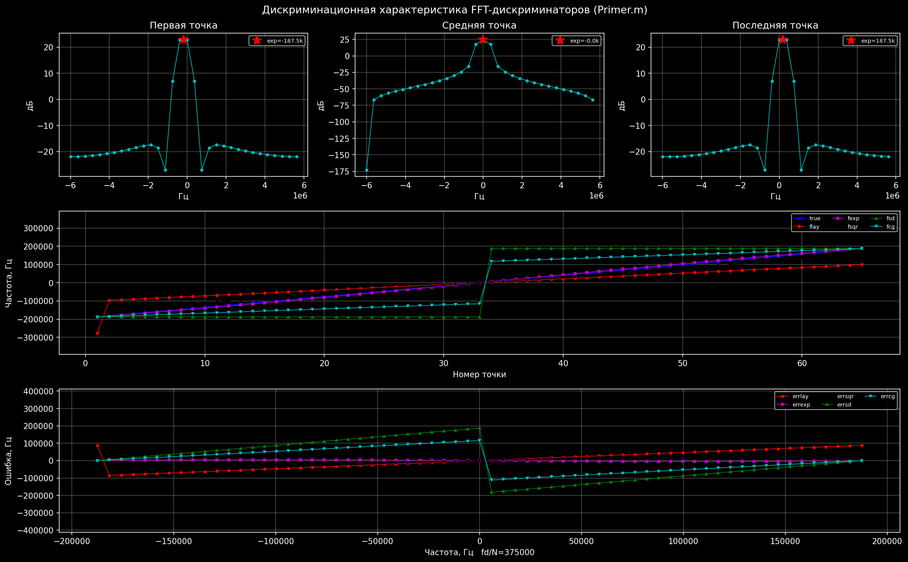
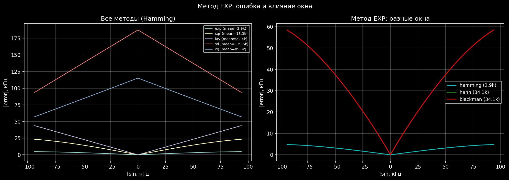

==========================
FFT-дискриминаторы частоты
==========================

.. rubric:: Применение дискриминаторов к оценке частоты по FFT-спектру

Дискриминаторы модуля применяются не только для оценки угловых
координат по ДН антенны, но и для **точной оценки частоты** по
FFT-спектру комплексного сигнала. Это исходная область применения
``discr3ea``, ``discr3qa``, ``discrsd``, ``discrcg`` в составе MatLab
``Primer.m``.

.. tip::

   Для современного CPU pipeline **наилучший выбор — discr5ea** с
   fallback на ``discr5qa`` и обязательным zero-padding ×2 + окно
   Hanning. Это даёт ошибку ~0.6 Гц при SNR = 20 дБ. Полное
   обоснование — :doc:`recommendations`.

----

Сигнал и параметры
==================

.. math::
   :label: eq:fft_signal

   x(t) = A \cdot \exp(j \cdot 2\pi \cdot f_{\text{sin}} \cdot t) + \text{noise}

.. list-table:: Типичные параметры теста
   :header-rows: 1
   :widths: 20 30 50

   * - Параметр
     - Значение
     - Описание
   * - :math:`N`
     - 32
     - Число отсчётов
   * - :math:`f_d`
     - 12 МГц
     - Частота дискретизации
   * - :math:`\Delta f = f_d/N`
     - 375 кГц
     - Ширина бина FFT
   * - :math:`f_{\text{sin}}`
     - :math:`[-\Delta f/2, +\Delta f/2]`
     - Sweep (±187.5 кГц)
   * - Окно
     - Hamming
     - -43 дБ боковые лепестки

----

Классические 5 методов оценки частоты
======================================

3-точечные (бины :math:`k-1, k, k+1`)
--------------------------------------

**EXP** (``discr3ea.c`` — парабола на :math:`\log|S|`):

.. math::

   z_i = \ln|S_i|,\quad
   \alpha = z_1(f_2^2 - f_3^2) + z_2(f_3^2 - f_1^2) + z_3(f_1^2 - f_2^2)

.. math::

   \beta = z_1(f_2 - f_3) + z_2(f_3 - f_1) + z_3(f_1 - f_2),\quad
   f_{\text{est}} = \frac{\alpha}{2\beta}

**SQR** (``discr3qa.c`` — парабола на :math:`|S|`):

.. math::

   A_o = \frac{A_2 - A_1}{A_2 - A_3},\quad
   f_{\text{est}} = \frac{(A_o - 1)f_2^2 - A_o f_3^2 + f_1^2}
                         {2\bigl((A_o - 1)f_2 - A_o f_3 + f_1\bigr)}

**LAY** (Jacobsen, ``fcalcdelay.m``):

.. math::

   \sigma = \frac{S_{k+1} - S_{k-1}}{2 S_k - S_{k-1} - S_{k+1}},\quad
   f_{\text{est}} = f_k - \operatorname{Re}\{\sigma\} \cdot \frac{f_d}{N}

2-точечные (top-2 бины по амплитуде)
-------------------------------------

**SD** (``discrsd.c``):

.. math::

   f_{\text{est}} = \frac{f_1 + f_2}{2}
                    + c \cdot \frac{P_2 - P_1}{P_2 + P_1},
                    \quad c = 0.132497

**CG** (``discrcg.c``):

.. math::

   f_{\text{est}} = \frac{A_1 f_1 + A_2 f_2}{A_1 + A_2}

----

Дискриминационная характеристика
=================================

   Дискриминационная характеристика 5 FFT-методов (sweep
   :math:`\pm \Delta f/2`).

**Верхний ряд**: спектры FFT при :math:`f_{\text{sin}} = -\Delta f/2, 0, +\Delta f/2`.
**Средний ряд**: оценки частоты vs истинная частота (65 точек sweep).
**Нижний ряд**: ошибка оценки.

----

Сравнение точности (классика)
==============================

Sweep :math:`\pm \Delta f/4`, :math:`N=32`, окно Hamming, без шума:

.. list-table::
   :header-rows: 1
   :widths: 15 30 25 30

   * - Метод
     - Средняя ошибка
     - Макс. ошибка
     - Рекомендация
   * - **EXP**
     - 2 902 Гц
     - 4 825 Гц
     - **Лучший для Hamming (3pt)**
   * - SQR
     - 13 553 Гц
     - 23 348 Гц
     - Хороший
   * - LAY
     - 22 933 Гц
     - 43 811 Гц
     - Biased (Jacobsen для Hamming)
   * - CG
     - 84 664 Гц
     - 115 270 Гц
     - Грубая оценка
   * - SD
     - 138 393 Гц
     - 187 500 Гц
     - Очень грубая (:math:`c=0.132497`)

----

Влияние оконной функции
========================

   Ошибка метода EXP для разных оконных функций.

**Левый график:** сравнение всех 5 методов (Hamming).
**Правый график:** метод EXP с окнами Hamming / Hann / Blackman.

**Blackman** даёт наименьшую ошибку для метода EXP — его форма
спектрального пика ближе всего к гауссиане.

----

Современный pipeline — discr5ea ★
==================================

Для новой задачи CPU FFT наилучший выбор — ``discr5ea`` (МНК-Гауссиан
по 5 точкам). Все подробности — :doc:`recommendations`.

.. code-block:: c

   #include "discr5ea.h"
   #include <complex.h>
   #include <stdlib.h>

   // X[]      — комплексный FFT-спектр (длина N_padded, zp×2)
   // k_max    — индекс грубой оценки (argmax |X(k)|)
   // fs       — частота дискретизации
   // N_padded — длина FFT с zero-padding

   double y[5], xs[5];
   for (int i = 0; i < 5; ++i) {
     y[i]  = cabs(X[k_max - 2 + i]);
     xs[i] = (double)(i - 2);
   }

   double delta;
   int ok = discr5ea(y, xs, &delta);
   if (ok != EXIT_SUCCESS) {
     discr5qa(y, xs, &delta);        // fallback
   }

   double f_hz = (k_max + delta) * fs / (double)N_padded;

**Типичная точность:**

- :math:`f_s = 100` МГц, :math:`N = 4M`, SNR = 20 дБ → **~0.6 Гц**
- То же, SNR = 30 дБ → **~0.21 Гц**
- То же, SNR = 10 дБ → **~1.73 Гц**

----

Запуск Python-тестов
====================

.. code-block:: bash

   # Тесты (10 проверок):
   python test_python/test_fft_frequency.py

   # Графики -> Doc/plots/fft_*.png:
   python test_python/test_fft_frequency_plot.py

----

Происхождение
=============

.. code-block:: text

   C-исходники (2010-2012)        MatLab               Python
   discr3ea.c (Добродумов) ──▶ discr='exp' ──▶ fft_discr_exp()
   discr3qa.c (Федоров)    ──▶ discr='sqr' ──▶ fft_discr_sqr()
   discrsd.c  (Федоров)    ──▶ discr='sd'  ──▶ fft_discr_sd()
   discrcg.c  (Федоров)    ──▶ discr='cg'  ──▶ fft_discr_cg()
   fcalcdelay.m            ──▶ discr='lay' ──▶ fft_discr_lay()

----

Дальше
======

- :doc:`recommendations` — финальные рекомендации для CPU pipeline
- :doc:`formulas` — все формулы методов
- :doc:`methods` — сравнительный обзор
- :doc:`tests` — тестовое покрытие
