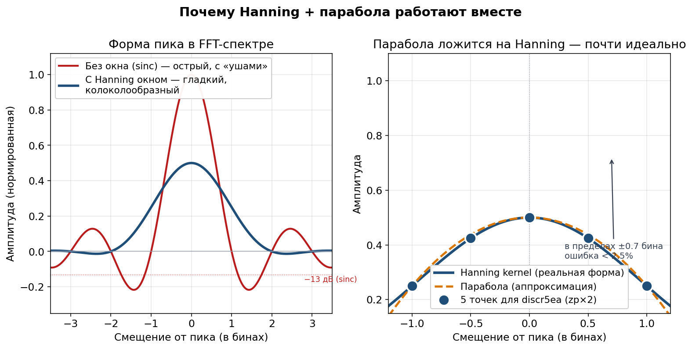
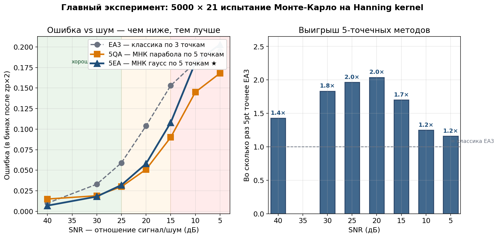

========
Формулы
========

.. rubric:: Полные математические формулы всех 6 методов

Это справочник всех формул дискриминаторов, реализованных в модуле.
Для каждого метода — идея, формула, граничные случаи и защитные
условия.

.. contents:: На этой странице
   :local:
   :depth: 2

----

1. Центр тяжести (CG)
=====================

Простейший метод. Координата оценивается как взвешенное среднее.

2-точечный — ``discr2cg``
-------------------------

.. math::
   :label: eq:cg2

   x_e = \frac{A_1 \cdot x_1 + A_2 \cdot x_2}{A_1 + A_2}

**Геометрический смысл:** координата центра масс двух точек с
«массами» :math:`A_1, A_2`.

3-точечный — ``discr3cg``
-------------------------

.. math::
   :label: eq:cg3

   x_e = \frac{A_1 x_1 + A_2 x_2 + A_3 x_3}{A_1 + A_2 + A_3}

N-точечный — ``discrncg``
-------------------------

.. math::
   :label: eq:cgn

   x_e = \frac{\sum_{i=0}^{N-1} A_i \cdot x_i}{\sum_{i=0}^{N-1} A_i}

.. admonition:: Защита
   :class: warning

   При :math:`\sum A_i = 0` возвращается средняя точка (ERR-005 fix).

----

2. Суммарно-разностный (SD)
===========================

Классический моноимпульсный метод — использует отношение разности к
сумме. Эта функция есть в радарных моноимпульсных приёмниках.

2-точечный — ``discr2sd``
-------------------------

.. math::
   :label: eq:sd_center

   x_c = \frac{x_1 + x_2}{2}

.. math::
   :label: eq:sd_delta

   \Delta x = c \cdot \frac{A_2 - A_1}{A_2 + A_1}

.. math::
   :label: eq:sd_res

   x_e = x_c + \Delta x

где :math:`c` — коэффициент крутизны дискриминаторной характеристики
(подбирается под ширину ДН и шаг сетки).

**Физический смысл:** :math:`\dfrac{A_2 - A_1}{A_2 + A_1}` —
нормированная разность, пропорциональная отклонению цели от
середины.

----

3. Квадратичная аппроксимация (QA)
==================================

Через 3 точки проводится парабола :math:`y = ax^2 + bx + c`, находится
её вершина.

3-точечный — ``discr3qa``
-------------------------

.. math::
   :label: eq:qa_ao

   A_o = \frac{A_2 - A_1}{A_2 - A_3}

.. math::
   :label: eq:qa_xe

   x_e = \frac{1}{2} \cdot
   \frac{(A_o - 1)\,x_2^2 - A_o\,x_3^2 + x_1^2}
        {(A_o - 1)\,x_2 - A_o\,x_3 + x_1}

Граничные случаи (ERR-004 fix, ``DBL_EPSILON``)
------------------------------------------------

.. list-table::
   :header-rows: 1
   :widths: 60 40

   * - Условие
     - Результат
   * - :math:`A_1 = A_2 = A_3`
     - :math:`x_e = x_2` (центр)
   * - :math:`A_2 = A_3,\ A_1 > A_2`
     - :math:`x_e = x_1`
   * - :math:`A_2 = A_3,\ A_1 < A_2`
     - :math:`x_e = (x_2 + x_3)/2`
   * - :math:`A_1 = A_2,\ A_3 > A_2`
     - :math:`x_e = x_3`
   * - :math:`A_1 = A_2,\ A_3 < A_2`
     - :math:`x_e = (x_1 + x_2)/2`

----

4. Экспоненциальная аппроксимация (EA)
======================================

Наиболее точный 3-точечный метод. Моделирует ДН/пик функцией Гаусса:

.. math::
   :label: eq:ea_model

   y(x) = A_{\max} \cdot \exp\!\bigl(-a \cdot (x - x_0)^2\bigr)

Алгоритм ``discr3ea``
---------------------

1. **Проверка входных данных** — все амплитуды > 0, не все равны.
2. **Сортировка** по возрастанию координаты :math:`x`.
3. **Проверка выпуклости** — максимум должен быть в центре. При
   вогнутости → ``EXIT_FAILURE``.
4. **Логарифмирование**:

   .. math::
      :label: eq:ea_log

      z_i = \ln(A_i),\quad i=1,2,3

   Задача сводится к параболической аппроксимации в логарифмическом
   масштабе.

5. **Вершина параболы**:

   .. math::
      :label: eq:ea_alpha

      \alpha = z_1(f_2^2 - f_3^2) + z_2(f_3^2 - f_1^2) + z_3(f_1^2 - f_2^2)

   .. math::
      :label: eq:ea_beta

      \beta = z_1(f_2 - f_3) + z_2(f_3 - f_1) + z_3(f_1 - f_2)

   .. math::
      :label: eq:ea_xe

      x_e = \frac{\alpha}{2\beta}

6. **Ограничение на вылет**:

   .. math::
      :label: eq:ea_clip

      f_1 - \frac{f_3 - f_1}{2} \leq x_e \leq f_3 + \frac{f_3 - f_1}{2}

Уточнение амплитуды ``discr3eaY``
----------------------------------

.. math::
   :label: eq:eaY_a0

   a_0 = \frac{z_1 - z_2}{2 x_e (x_1 - x_2) - x_1^2 + x_2^2}

.. math::
   :label: eq:eaY_ye

   y_e = A_2 \cdot \exp\!\bigl(a_0 \cdot (x_2 - x_e)^2\bigr)

----

5. МНК-парабола по 5 точкам (5QA)
==================================

**Идея:** вместо параболы, идеально проходящей через **3** точки,
аппроксимируем параболой **5** точек по методу наименьших квадратов.
Получаем переопределённую систему — 5 уравнений на 3 неизвестных
:math:`(a, b, c)`:

.. math::
   :label: eq:5qa_sys

   A_i \approx a\,x_i^2 + b\,x_i + c,\qquad i = 1,\ldots,5

В матричной форме:

.. math::
   :label: eq:5qa_matrix

   \mathbf{H}\,\boldsymbol{\theta} = \mathbf{y},\quad
   \mathbf{H} =
   \begin{pmatrix}
     x_1^2 & x_1 & 1 \\
     x_2^2 & x_2 & 1 \\
     x_3^2 & x_3 & 1 \\
     x_4^2 & x_4 & 1 \\
     x_5^2 & x_5 & 1
   \end{pmatrix},\quad
   \boldsymbol{\theta} = \begin{pmatrix} a \\ b \\ c \end{pmatrix}

МНК-решение через нормальные уравнения:

.. math::
   :label: eq:5qa_normal

   (\mathbf{H}^{\!\top}\mathbf{H})\,\boldsymbol{\theta}
   = \mathbf{H}^{\!\top}\mathbf{y}

Замкнутая формула для :math:`x_i = \{-2,-1,0,1,2\}`
----------------------------------------------------

Для равномерной сетки матрица :math:`\mathbf{H}^{\!\top}\mathbf{H}`
блочно-диагональна (сумма нечётных степеней равна нулю), и решение
можно выписать в **замкнутом виде**:

.. math::
   :label: eq:5qa_a

   a = \frac{2A_1 - A_2 - 2A_3 - A_4 + 2A_5}{14}

.. math::
   :label: eq:5qa_b

   b = \frac{-2A_1 - A_2 + A_4 + 2A_5}{10}

.. math::
   :label: eq:5qa_delta

   \delta = -\frac{b}{2a},\qquad x_e = x_3 + h\,\delta

где :math:`h` — шаг сетки, :math:`x_3` — центральная точка.

**Свойства:**

- Сложность: :math:`\mathcal{O}(1)` — 6 умножений + 7 сложений + 1 деление.
- Не требует никаких циклов и матричных вычислений.
- В нормальной зоне даёт ошибку ~2× меньше, чем 3-точечная QA.

   Слева — форма пика ``sinc`` vs ``Hanning``. Справа — как парабола
   ложится на Hanning kernel: ошибка <2.5% в пределах ±0.7 бина.

.. admonition:: Защита
   :class: warning

   При :math:`|a| < 10^{-30}` возвращается :math:`x_e = x_3` — данные
   плоские, оценить нельзя.

----

6. МНК-Гауссиан по 5 точкам (5EA) ★
====================================

Самый точный из реализованных методов. Аппроксимирует пик
**гауссианом** (колоколом) методом наименьших квадратов:

.. math::
   :label: eq:5ea_model

   y(x) \approx A_{\max} \cdot \exp\!\bigl(-a\,(x - x_0)^2\bigr)

Алгоритм
--------

**Шаг 1.** Логарифмирование амплитуд:

.. math::
   :label: eq:5ea_log

   z_i = \ln A_i, \quad i = 1,\ldots,5

В лог-пространстве гауссиан превращается в **параболу**:

.. math::
   :label: eq:5ea_parabola

   z(x) = -a(x - x_0)^2 + \ln A_{\max} = a'x^2 + b'x + c'

**Шаг 2.** К массиву :math:`z_i` применяем те же замкнутые
МНК-формулы, что и в 5QA:

.. math::
   :label: eq:5ea_a

   a = \frac{2z_1 - z_2 - 2z_3 - z_4 + 2z_5}{14}

.. math::
   :label: eq:5ea_b

   b = \frac{-2z_1 - z_2 + z_4 + 2z_5}{10}

**Шаг 3.** Вершина параболы → оценка :math:`x_e`:

.. math::
   :label: eq:5ea_delta

   \delta = -\frac{b}{2a}, \qquad x_e = x_3 + h\,\delta

Когда не работает
-----------------

Метод требует **строго положительных** амплитуд: :math:`A_i > 0`.
Иначе :math:`\ln A_i` не определён.

**Стратегия fallback** в боевом коде:

.. code-block:: c

   int ok = discr5ea(A, x, &xe);
   if (ok != 0) {
     // что-то ≤ 0 или результат за границей
     discr5qa(A, x, &xe);   // ← переходим на 5QA по амплитудам
   }

Почему именно Гауссиан
----------------------

Главное наблюдение проекта: после применения **окна Hanning** и FFT
форма одиночного спектрального пика (Hanning kernel) **очень близка к
гауссиану** в пределах главного лепестка. Поэтому модель
:math:`y \approx A_{\max}\exp(-a(x-x_0)^2)` является **физически
обоснованной** для типичного FFT-пайплайна.

----

7. Сравнение всех методов
=========================

   Монте-Карло сравнение при разных SNR (105 000 испытаний).

Таблица сравнения
-----------------

.. list-table::
   :header-rows: 1
   :widths: 12 10 18 18 12 30

   * - Метод
     - Точек
     - Bias (без шума)
     - Шумоустойчивость
     - Сложность
     - Требования
   * - **CG**
     - 2…N
     - ~0.17 шага
     - низкая
     - :math:`\mathcal{O}(N)`
     - :math:`\sum A_i \neq 0`
   * - **SD**
     - 2
     - ~0.10 шага
     - средняя
     - :math:`\mathcal{O}(1)`
     - подобрать :math:`c`
   * - **QA**
     - 3
     - ~0.01 шага
     - средняя
     - :math:`\mathcal{O}(1)`
     - :math:`A_i` любые
   * - **EA**
     - 3
     - ~0.005 шага
     - средняя
     - :math:`\mathcal{O}(1)`
     - :math:`A_i > 0`
   * - **5QA**
     - 5
     - ~0.005 шага
     - **высокая**
     - :math:`\mathcal{O}(1)`
     - :math:`A_i` любые
   * - **5EA** ★
     - 5
     - ~0.003 шага
     - **высокая**
     - :math:`\mathcal{O}(1)`
     - :math:`A_i > 0`

Вердикт Монте-Карло (Hanning kernel, zp×2, 105 000 испытаний)
--------------------------------------------------------------

.. list-table::
   :header-rows: 1
   :widths: 40 60

   * - SNR (дБ)
     - Выигрыш лучшего 5pt относительно EA3
   * - 40 (идеал)
     - :math:`\times 1.4`
   * - 30 (отлично)
     - :math:`\times 1.8`
   * - 25 (хорошо)
     - :math:`\times 2.0`
   * - 20 (норма)
     - :math:`\times 2.0`
   * - 15 (шумно)
     - :math:`\times 1.7`
   * - 10 (плохо)
     - :math:`\times 1.2`
   * - 5 (ужас)
     - :math:`\times 1.2`

**5pt-методы стабильно выигрывают в 1.2–2.0 раза при любом уровне шума.**

.. figure:: ../plots/2_no_noise/lsq_abs_error_vs_x0.png
   :alt: МНК 5/7/9 без шума — EA-кривые в ~10× ниже QA
   :align: center
   :width: 100%

   МНК 5/7/9 без шума: EA-кривые в ~10× ниже QA-кривых.

----

8. Обёртка discr3() — коэффициент пересчёта
============================================

Для обёрток ``discr3()`` и ``discr3_()`` координаты пересчитываются:

.. math::
   :label: eq:discr3_c

   c = \frac{2\pi \cdot dx}{\lambda}

где :math:`dx` — шаг антенной решётки, :math:`\lambda` — длина волны.

Координаты масштабируются :math:`x' = x \cdot c`, а оценка
возвращается в исходных единицах: :math:`x_e = x'_e / c`.

.. admonition:: ERR-003 fix
   :class: important

   После рефакторинга входные массивы **не модифицируются** —
   координаты умножаются на :math:`c` при передаче в дискриминатор,
   а не в самом массиве.

----

Дальше
======

- :doc:`methods` — сравнительный обзор методов с графиками
- :doc:`recommendations` — итоговые рекомендации
- :doc:`visual` — визуальный разбор
- :doc:`api` — справочник C API
